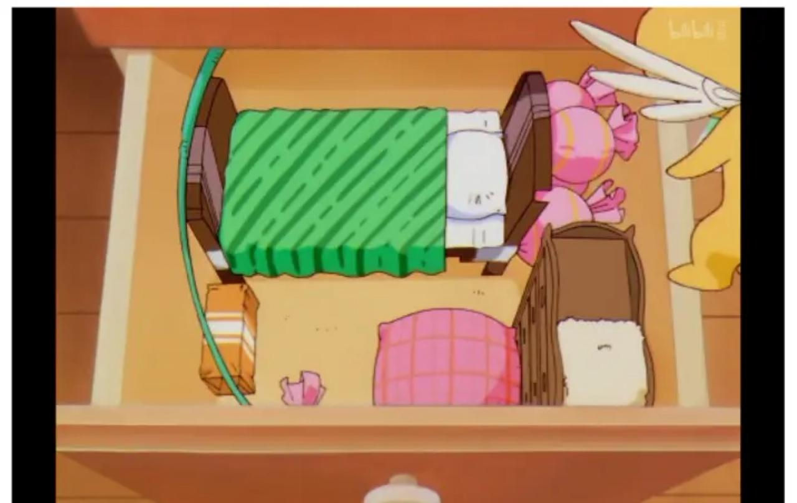

## 01

“小可，小可！”

？

“小可，快起床啦！”

？？

“今天家里要来爸爸的客人，你就好好地在房间里呆着，千万不要发出什么奇怪的声音哦！我等会儿会带东西来给你吃的，所以好好的呆着！我先下去帮忙啦！”

？？？

睁开迷糊的双眼，熟悉、活泼的女孩声音从外面传来，和随之而来的一声关门声把正在床上睡得酣畅淋漓的小玩偶吓了一跳。它揉了揉小的几乎看不见的眼睛，从和自己一样迷你可爱的小床上猛然爬起，迷糊的坐在床上，条件反射般地想关掉旁边的【闹钟】，结果是，短短的小手在空气中摇晃了半天，却什么都没碰到。

"wuiiiii,要迟到啦！唉？怎么回事，这是在哪儿？"玩偶突然清醒了，开始冷静下来观察四周：一个狭窄的木制小房间里，站起来天花板几乎要碰到自己的头顶。自己坐着的白色小床上放着一床绿色的丝绒被子，虽然做工不是很好，但是摸起来却有一种很温馨和熟悉的触感。床旁边摆放着一个看起来是用糖果皮和纸壳班做成的简易小木桌，木桌对面是一个几乎要达到【天花板】高度的木柜。床的后面以及旁边散落着一个一个的...巨大的糖果？【玩偶】还没见过这么大大糖果，不禁好奇地拿起一颗准备一探究竟。

"哎！好软啊！"【玩偶】吃了一惊，这哪是什么糖果，而是用布和棉花做成的糖果型枕头！这是什么，太可爱了吧！【玩偶】发出惊叹的声音。这么大的抱枕，想必制作的人也花了很多时间吧！就和知世【Tomoyo】酱一样...

「知世...?」脑海中突然闪现的名字让玩偶突然一愣。【玩偶】拼命回想，这是谁的名字？一想起来就心头一暖，仿佛看见了一张无比温柔的脸正朝着自己微笑，这么这么温柔的存在，怎么就是回想不起更多的细节呢。

"相比想起他人的名字，还是先回忆起自己的身份吧！"

"谁？"突然传来的声音让【玩偶】又吓了一跳，不对，这是，刚刚才听到的温柔女孩的声音！只不过，这次声音的来源似乎并不是在【外面】，而是近在身边的存在。

"这里，这里，来桌子这边..."【玩偶】寻着声音，一眼便看见了旁边糖果桌子上面摆着的卡牌。卡牌闪着微弱的光，光芒随着声音而微微起伏，吸引着【玩偶】上前去将其拿起。

【The Time】。时牌。

.JPEG "1")

一位穿着法袍的老人，举着象征着【时间】的沙漏，低沉着沧桑的脸，似乎孤独而无奈的看着沙子缓缓地流下。沙漏，据说是亚历山大时期的发明，曾跟随着这位伟大的君王向着无垠之海的方向前进，作为记录时间的工具而存在。时光荏苒，曾经气势恢宏的君王早已化为连沙尘不剩的存在，但是同样的沙子，在这名为【沙漏】的存在中，所经历的物理过程却恒久不变——那就是【时间】本身。

可是，就是在这刻画着沧桑老人的卡牌中，却传出了与之不符的少女声音。

"小可，小可！【封印兽】可鲁贝洛斯..."

【玩偶】又吃了一惊，又是一个无比熟悉的名字，但是从这少女的声音中念出，总觉得哪里有些不对劲。一种强烈的违和感充斥其中，但是当想去寻找原因中，脑子却像哪里被堵住了一样什么也想不起来。

【小可】...

【小可】...

【小可】...

头突然剧烈地疼了起来，眼前的画面开始模糊，突然，【玩偶】发现自己已经不在之前的小木屋中，眼前是一片如同星空般深邃的空间，漆黑的星空向着无穷远处延伸。脚底下是闪着金光的魔法阵，而在魔法阵的最中央...

"小可！你想起来了嘛，小可？"在魔法阵最中央的，是有着与刚才的声音完全匹配的女孩。女孩一头深棕色头发，一双灵动的翠眼，让人看了就充满了元气和希望的外貌。但是与外表所不匹配的是，女孩的手此时正紧紧撑在魔法阵的正中间，表情也是一年强撑，仿佛下一秒就会倒下一般，让【玩偶】不由得开始担心起来。

“你没事吧...”

“没事的，只是魔力的消耗比想象中的要大，能撑的时间也不多了...”女孩强撑笑颜，看着眼前的【玩偶】，哦不，据她所说，应该是【小可】。

“看来还是受到了强行使用【时】牌的影响，记忆散失了...不过小可，如果是你的话，我相信你一定可以寻着记忆【星星】的线索，回想起一切的，没问题，一定没问题的...”

听到这话【小可】心头不禁一震。小可，小可，这就是我的名字吗...

突然，魔法阵有了些许变化，原本刻画着星星，月亮和太阳的魔法阵，忽然变成了时钟的模样，闪烁着与刚才看起来截然不同的光芒。“哼啊...”女孩看起来很痛苦一般，但是过了一小会儿，又开始诉说了起来。

“很多很多年前，地球上诞生了有史以来最为伟大的魔法师，库洛·里德，那就是你的创造者。里德用自己的魔力创造出了53张威力强大的卡牌，它们各不相同，但是都具有着神奇的功能并且有着自己的灵魂，这就是【库洛牌】。为了守护这些卡牌们，里德创造出了两位守护兽，其中一位便是你，可鲁贝洛斯！然而在数百年前，这位强大的魔法师忽然离世，留下的库洛牌立刻成了大家竞相抢夺的东西。但是从那以后库洛牌就消失在了历史的长河中。直到最近几年，西方魔术协会感受到了极大的魔力不平衡，便派出强大的魔术师进行调查。结果发现，这些原本早已被认为消失了的卡牌，居然被再一次解除了封印。”

“是的，可鲁贝洛斯，那就是我们的相遇。我无意之中解除了库洛牌的封印，而作为库洛牌的守护者，你告诉我，【库洛牌解除封印之时，世界将会陷入巨大的危机之中】。于是，我们踏上了寻找库洛牌的旅途。我们并肩作战，一同努力，终于在最后通过了【月】的审判，成为了库洛牌的新主人...”

女孩像是想起了上面不好的事情一样，皱起了眉头。“可是，好景不长，西方派来的魔法师最终还是找到了我们，他们企图用蛮力抢走【库洛牌】，为此不惜动用了禁忌魔法...”

“禁忌魔法？那是什么样的魔法？”

“他们...他们使用魔法干扰了我的灵魂，让我的灵魂飘落到了远方的星星...所以我现在只能以这个姿态和你说话。但是，我相信可鲁贝洛斯，你一定能够破除魔法，去...解救...【小樱】的...”

“小樱？”听到这个名字，各种复杂的情感在小可心中翻腾起来。封印兽，库洛牌，库洛·里德，小樱，库洛魔法使...小可似乎回想起了一切的记忆。

“嗯...小可...”【小樱】有些生硬地笑着。“请你一定要破解魔法，到时候，我们一定要，再相见...”

忽然，魔法阵开始闪烁，空间再次混乱，女孩的身影开始模糊。不要啊，还有很多不知道的事情啊，怎么又要突然消失了，不要再分开，不要再分开。小可在心中疯狂的喊着，但是最后只喊出一句。

“小樱！！！！！！！！！！”

在星星的彼岸，女孩又温柔地笑着。

## 资料集in bookcase

【时牌，The Time】

一位穿着法袍的老人，举着象征着【时间】的沙漏，低沉着沧桑的脸，似乎孤独而无奈的看着沙子缓缓地流下。沙漏，据说是亚历山大时期的发明，曾跟随着这位伟大的君王向着无垠之海的方向前进，作为记录时间的工具而存在。时光荏苒，曾经气势恢宏的君王早已化为连沙尘不剩的存在，但是同样的沙子，在这名为【沙漏】的存在中，所经历的物理过程却恒久不变——那就是【时间】本身。

但是，就如同沙漏的容量有限，其所能表示的时间也是有限。使用者只能回溯一天的时间，如果强行灌入魔力来达成效果，就如同向沙漏强行注入沙子一般，将会对使用者产生不可预估的影响。

【镜牌，The Mirror】

象征着深切看清自己的时期，具有复制人或物的魔法，但也可以做一般的镜子。

镜子是世界上独特的存在，无论是多么复杂的物体，在镜子当中所展现出来的，总会是一模一样的复制体。因此，只要使用者的魔力足够大，就连复制灵魂这种事情，似乎也能够达到...