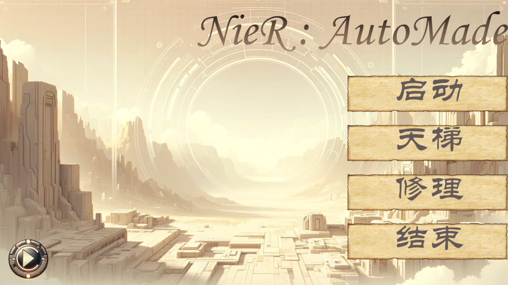
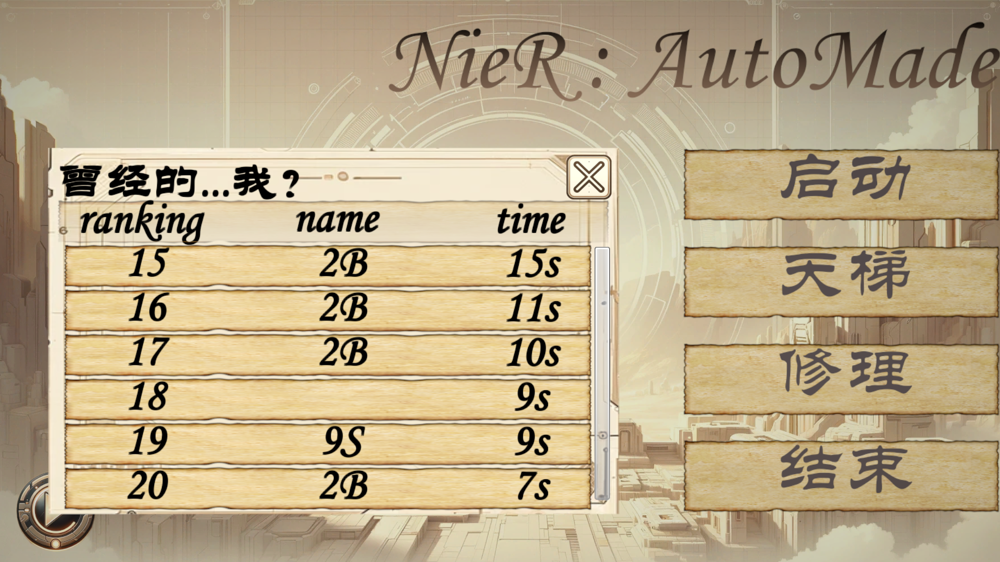
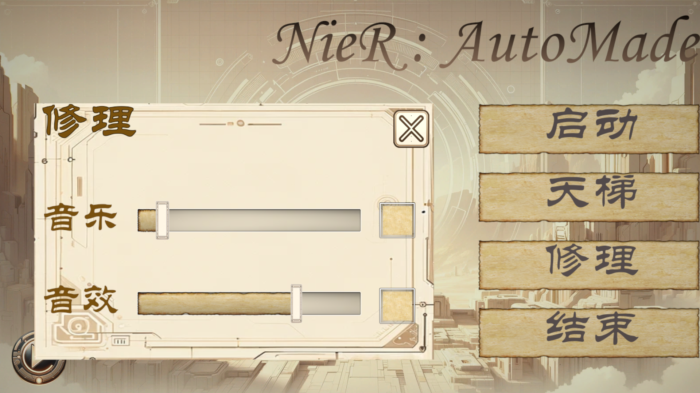
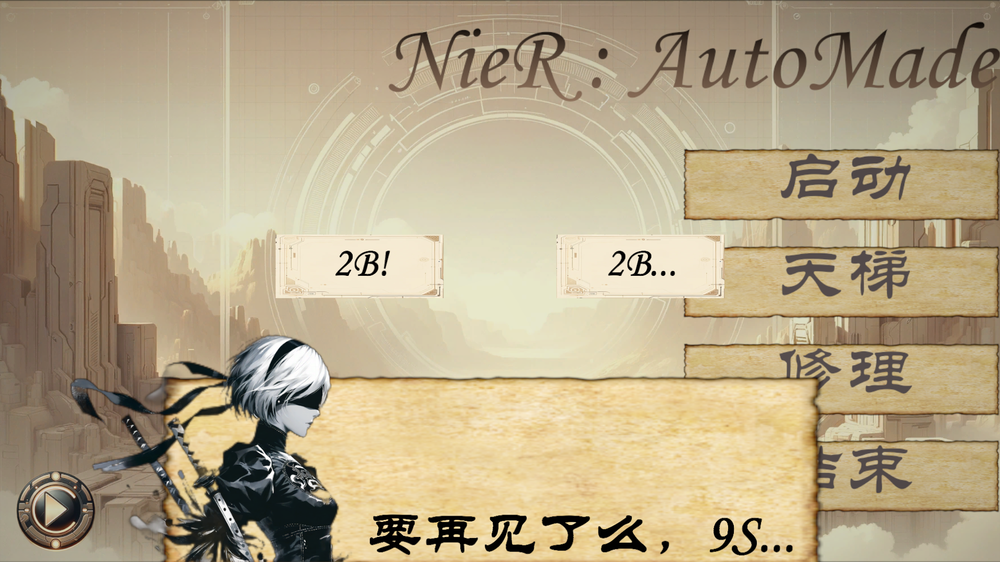
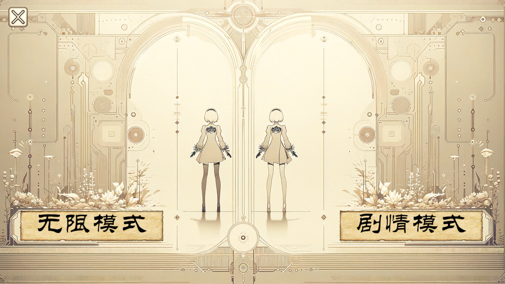
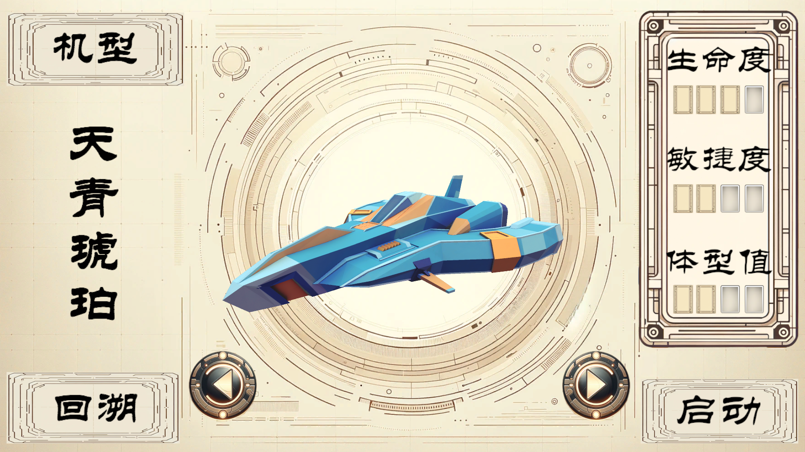
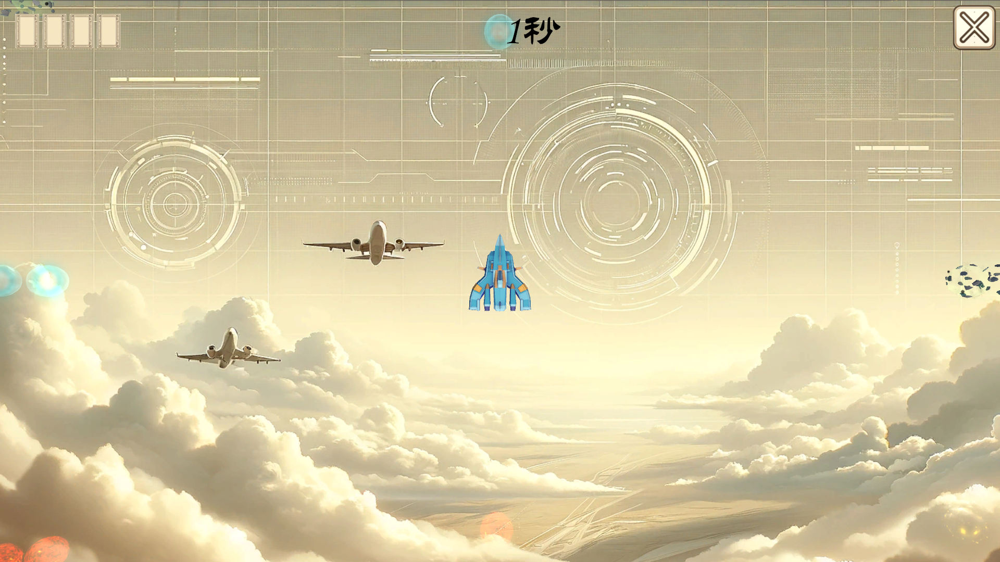
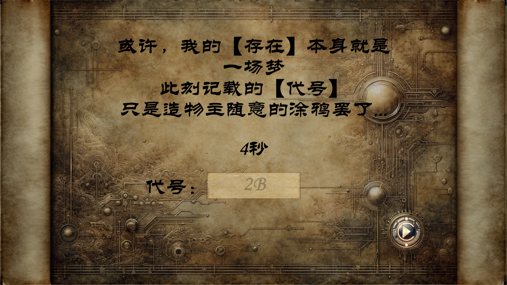

来填一下坑，记录一下之前立flag做的尼尔版的飞机大战！

当然是做完了初版了的（后续的就不立flag了）。

代码方面，除了炮台的子弹发射部分（想着后面如果做Boss战的时候再学）的代码是CV过来然后改的，其他绝大多数代码都是自己跟着视频敲的，为了练习，甚至CV都没有，好处当然也是比较显而易见的，熟练度确实有了不小的提高。

当然，由于教程中所使用的是NGUI，除了我自己用的一小部分UGUI外，我在这次小游戏里面所采用的也是NGUI。当然，后续是肯定要改为UGUI中，这将在我下一个复刻的小游戏中体现。

废话少说，直接上图。

这是游戏的开始界面，背景图和按钮图均由AI生成。事实上这个小游戏的所有2D美术资源都是由AI生成的，让我对AI的能力再次发出惊叹。

主界面以及这个小游戏所有页面和UI元素，我都是按照尼尔的UI界面风格来设计的。

首先这里有一个排行榜的功能，代码逻辑也是复刻的唐老狮的，采用xml的方法进行存储，即使退出了游戏再进去数据也不会消失。

然后就是音乐控制，可以控制BGM的大小以及开关，同样采用xml来存储数据，设置好了之后退出，音乐数据也会得到保存。当然，由于没有弄音效，所以音效暂时还听不出来。

退出界面！本谜语人上线了，到底选哪个才是退出呢？顺带一提，这个2B的图片也是AI生成的，真的神中神。

然后是点击开始后，会弹出模式选择界面（flag界面），但实际上只有一个模式，那就是无限模式，如果点击另一个模式就会弹出一些有趣的东西。这张背景图也是由AI生成的，真的是惊艳到我了。

然后就是模型选择界面，UI元素和背景都是AI生成的，按左右可以切换机型，这里就不展示了。模型使用的都是来自唐老狮的模型资源，之后有空可能会考虑自己用Blender做几个飞机和子弹出来。

然后就是游戏界面了，可以说设计的非常简洁，不过因为没怎么调数值，还怪难的，最多撑了一分钟就G了。

死亡界面，留下你的代号，然后返回吧！

游戏大概就是这样，自认为完成度还是很高的（得益于AI力量的加持），感兴趣的小伙伴可以到我的仓库去下载玩一下： [YeagerYuan/PlaneFight-Nier: 这是一个根据唐老狮教材做的Unity飞机小游戏。2D美术资源全部来自AI生成，音乐来自尼尔·机械纪元。可以在Windows,Linux平台运行。 (github.com)](https://github.com/YeagerYuan/PlaneFight-Nier) 

百度网盘：链接：https://pan.baidu.com/s/1OlZbex6qjTiq2BWVsKUZ5A?pwd=up2q 
提取码：up2q