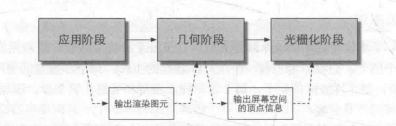

Unity中的**渲染管线**和图形学中的渲染管线基本上指的是相同的概念，但是具体实现和细节方面可能存在一些差异。
		Unity的渲染管线建立在图形学的基础上，但是它具有自己的实现和拓展提供了一个高度可配置和可拓展的框架，允许开发者根据需求自定义渲染流程，
之后讲解的渲染管线相关知识主要针对Unity中的实现。

### 什么是渲染管线?

渲染管线(渲染流水线)，它是计算机图形学中用于将**三维场景**转换为**最终屏幕所见图像**的过程。它是由一系列的阶段和操作组成的，每个阶段都负责执行特定的任务逐步处理输入的集合数据和纹理信息最终生成可视化图像的过程。
渲染管线(流水线)就是将数据分阶段的变为屏幕图像的过程

### 渲染管线中的数据指的是什么?

渲染管线(流水线)的概念是:将数据分阶段的变为屏幕图像的过程这里的数据指的是:
		1.**顶点数据:**模型的顶点坐标、法线向量、纹理坐标等等。
		2.**纹理数据:**纹理贴图等。
		3.**光照数据:**光照参数、光源信息等等等 Unity场景上相关的数据。

### 渲染管线中的分阶段指的是什么?

渲染管线(流水线)的概念是:将数据分阶段的变为屏幕图像的过程。

这里的分阶段指的是:渲染管线分为3个阶段：

**应用阶段-->几何阶段-->光栅化阶段**

在每一个阶段都会对数据进行处理，**最终目的**就是在屏幕上让我们看见最终的图像。

## 应用阶段

这个阶段是由我们的应用主导的，因此通常由CPU负责实现。换句话说，我们这些开发者具有这个阶段的绝对控制权。 

在这一阶段中，开发者有3个主要任务：首先，我们需要准备好场景数据，例如摄像机的位置、视锥体、场景中包含了哪些模型、使用了哪些光源等等；其次，为了提高渲染性能，我们往往需要做一个粗粒度剔除(culling)工作，以把那些不可见的物体剔除出去，这样就不需要再移交给几何阶段进行处理；最后，我们需要设置好每个模型的渲染状态。这些渲染状态包括但不限于它使用的材质(漫反射颜色、高光反射颜色)、使用的纹理、使用的 Shader 等。这一阶段最重要的输出是渲染所需的几何信息，即渲染图元(rendering primitives)。通俗来讲，渲染图元将会被传递给下一个阶段——几何阶段。

应用阶段大致可分为下面3个阶段： 

(1)把数据加载到显存中。 

(2)设置渲染状态。 

(3)调用Draw Call。

要注意的是，Draw Call过多时，性能瓶颈是由CPU造成的，我们可以用批处理技术来优化。

## 几何阶段

在渲染管线中，图元是指几何数据的基本单元它是构成几何体的最小可绘制的单元图元可以是点、线、三角形，在渲染管线的几何阶段，顶点数据会被组合为图元这些图元将在后续的光栅化阶段转换为像素，最终呈现在屏幕上。

几何阶段用于处理所有和我们要绘制的几何相关的事情。例如，决定需要绘制的图元是什么,，样绘制它们，在哪里绘制它们。这一阶段通常在GPU上进行。所有渲染所需的数据都需要从硬盘(Hard Disk Drive,HDD)中加载到系统内存(Random Access Memory,RAM)中。然后，网格和纹理等数据又被加载到显卡上的存储空间——显存(Video Random Access Memory, VRAM)中。这是因为，显卡对于显存的访问速度更快，而且大多数显卡对于RAM没有直接的访问权利(苹果除外， 在苹果的统一内存架构中，CPU 和 GPU 使用相同的内存池 )。

在渲染管线(流水线)的几何阶段**最主要做的工作就是对顶点进行处理**，并**进行坐标转换裁剪画面外的图元**。最主要完成的就是将模型的顶点从其**本地坐标**转换到最终的**屏幕坐标**中。对于我们来说，我们只要在顶点着色器中进行一些操作就可以带来不同的表现效果的体现，比如:水波纹、布料等等。

### 顶点着色器:

它处理来自应用阶段由CPU传递过来的顶点相关数据，输入进来的每一个顶点都会调用一次顶点着色器中的逻辑顶点着色器需要完成的工作主要有:
		**1.坐标变换** -- 顶点变换、法线变换、纹理坐标变换等

**2.顶点属性处理**-- 对顶点的其他属性进行处理，比如顶点颜色、透明度、切线向最等，可以用于实现顶点动画、着色、光照等效果

**3.顶点插值** -- 计算顶点属性的插值

对于我们来说顶点着色器是**完全可编程**的。	

### 裁剪：

由于我们的场景可能会很大，而摄像机的视野范围很有可能不会覆盖所有的场景物体，一个很自然的想法就是，那些不在摄像机视野范围的物体不需要被处理。而裁剪(Clipping)就是为了完成这个目的而被提出来的。我们可以进行一些配置，但一般情况下不需要进行任何处理，渲染管线会帮我们进行处理。

### 屏幕映射 ：

这一步输入的坐标仍然是三维坐标系下的坐标(范围在单位立方体内)。屏幕映射(Sereen Mapping)的任务是把每个图元的x和y坐标转换到屏幕坐标系(Sereen Coordinates)下。屏幕坐标系是一个二维坐标系，它和我们用于显示画面的分辨率有很大关系。

有一个需要引起注意的地方是，屏幕坐标系在OpenGL和DirectX 之间的差异问题。OpenGL把屏幕的左下角当成最小的窗口坐标值，而DirectX则定义了屏幕的左上角为最小的窗口坐标值。 下图显示了这样的差异。

## 光栅化阶段

**片元:**在渲染管线中，片元是指在光栅化阶段生成的像素或像素片段。片元是渲染管线中进行像素级别操作和计算的基本单位每个片元代表了屏幕上的一个像素，并且具有位置信息和与之相关的属性，比如:**颜色、深度值、法线**等等。

光栅化阶段有两个最重 要的目标：计算每个图元覆盖了哪些像素，以及为这些像素计算它们的颜色。

光栅化阶段有四个小阶段：三角形设置，三角形便利，片元着色器和逐片元操作。

### 三角形设置：

光栅化的第一个流水线阶段是**三角形设置(Triangle Setup)**。这个阶段会计算光栅化一个三角网格所需的信息。具体来说，上一个阶段输出的都是三角网格的顶点，即我们得到的是三角网格每条边的两个端点。但如果要得到**整个三角网格对像素的覆盖情况**，我们就必须计算**每条边上的像素坐标**。为了能够计算边界像素的坐标信息，我们就需要得到**三角形边界的表示方式**。这样一个**计算三角网格表示数据**的过程就叫做三角形设置。它的输出是为了给下一个阶段做准备。

### 三角形遍历 ：

三角形遍历(Triangle Traversal)阶段将会检查每个像素**是否被一个三角网格所覆盖**。如果被覆盖的话，就会生成一个**片元(fragment)**。而这样一个找到哪些像素被三角网格覆盖的过程就是三角形遍历，这个阶段也被称为扫描变换(Scan Conversion)。 

三角形遍历阶段会根据上一个阶段的计算结果来判断一个三角网格覆盖了哪些像素，并使用三角网格3个顶点的顶点信息对整个覆盖区域的像素进行插值。

### 片元着色器(像素着色器)：

它主要完成对 三角形遍历输入的片元序列中的每个片元(像素)的着色计算和属性处理。片元着色器需要完成的工作主要有:

1.光照计算 -- 计算片元的光照效果。

2.纹理映射 -- 根据片元在纹理中的位置，对纹理进行采样，将纹理颜色映射到片元上，实现表面贴图效果- 根据材质的属性，比如颜色、透明度、反射率等，计算片元的最终颜色和透明度。

3.材质属性处理。

4.阴影计算 -- 林根据光源等信息，计算片元是否处于阴影中，影响其最终颜色。

etc.

对于我们来说片元着色器是**完全可编程**的。

### 逐片元操作 ：

到了渲染流水线的最后一步。**逐片元操作**(Per-Fragment Operations)是OpenGL中的说法，在DirectX中，这一阶段被称为输出合并阶段(Output-Merger)。

它主要完成对片元着色器输出数据(最终颜色、法线、纹理坐标、深度等)进行各种处理和计算。

逐片元操作主要完成的工作主要有:

1.决定每个片元的可见性，比如深度测试、模板测试

2.如果通过了所有测试，需要把片元的颜色值和已经存储在颜色缓冲区的颜色进行合并(混合)等等。

对于我们来说逐片元操作是**可配置**的。

