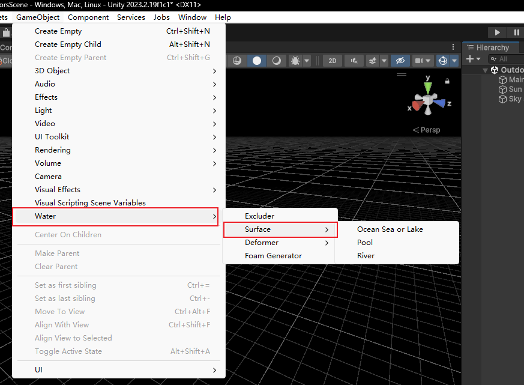

unity最新版本中提供了高清渲染管线中的全新水系统，可以在unity场景中创建一片逼真的水体。下面我们来介绍一下详细的创建步骤。

## 安装最新的Unity

HDRP水系统的部分功能在2022LTS版本中也可以使用，但是为了体验到全部功能，建议还是安装最新的2023.2版本。我这里使用的是Unity最新发布的2023.2.19f1c1版本。

## 创建项目以及渲染设置


我们选择High Definition 3D模板，这个模板下使用的是HDRP管线。


找到project settings，在Quality中找到HDRP，然后我们进入Rendering,勾选上Water的Enable，为了演示效果，我们把所有的选项都勾选上。（在此之前会弹窗HDRP Wizard,可以点击Embed Configuration Editable Package）。


找到场景中的Sky and Fog Volume。 在Unity中，使用HDRP时，“Sky and Fog Volume”是用于控制天空、雾和大气效果的组件。这个组件允许你详细地配置和自定义游戏或可视化项目中的天空盒和大气效果，使之更加逼真和符合场景的需求。 然后我们添加WaterRendering组件（点击add override)，打开state并且激活。

## 添加水



在GameObject里面找到Water,surface里面有三种水，它们的区别如下：

| 种类 | Ocean Sea or Lake                                          | Pool                                                       | River                                                      |
| ---- | ---------------------------------------------------------- | ---------------------------------------------------------- | ---------------------------------------------------------- |
| 图片 |  |  |  |

它们的区别在于波浪的复杂性和预期用途。当创建了一种后，后面还可以在组件WaterSurface中进行更改。

## WaterSurface讲解

### Ocean

```
— General: 定义水体的整体类型（如海洋/海洋/湖、河流、水池）和用于渲染水面的几何形状（如四面、定制、四周、无限）
— Simulation: 控制波纹和涟漪如何影响水面的形成
— Deformation: 影响局部变形如何升高或降低水的一部分，用于瀑布或其他高度变化
— Appearance: 确定水的颜色、平滑度、折射和光散射；焦散和特殊的水下设置增强基于物理的阴影
— Foam: 控制波顶、水中物体周围或沿海岸线的泡沫外观和行为
— Miscellaneous: 控制渲染层掩模和调试模式
```

#### Simulation

Ocean中的simulation用于控制水平面的波纹，它分为Swell( 涌浪，用于模拟大尺度的水体动态，如海洋或大湖波动，常用于增加场景的自然感和动态感 )和Ripples（涟漪， 常用于模拟细微的水面扰动，增加环境的细节和活力，例如模拟雨后水面的波纹或鱼儿游动引起的水动 ）。

可以把FirstBand理解为粗调，SecondBand理解为微调，Ripples为细节。

| 介绍     | 设置                                                        | 效果                                                        |
| -------- | ----------------------------------------------------------- | ----------------------------------------------------------- |
| 全部开启 |  |  |
| 关闭涟漪 |  |  |
| 全部关闭 |  |  |

### River

river使用agitation(搅动)控制较低频段，这相当于Ocean的SecondBand。Ripples和Ocean的类似。


### Pools

pools只使用Ripples,它最大的特点是可以自定义形状，这是通过设置Geometry Type为custom,然后选择自己准备好的mesh renderer，就可以让水体以自己希望的方式呈现。


## 导入官方示例

unity官方提供了四种水的实例场景，这在HDRP的资源包中可以找到。


| **Swimming Pool** | 这个场景显示了在不同高度的水池的多个水面。它还演示了使用自定义网格来实现除基本矩形之外的唯一池形状。 |  |
| ----------------- | ------------------------------------------------------------ | ------------------------------------------ |
| **Island**        | **这个场景的特点是一个被海浪包围的小陆地。水面具可以清除岛上周围的膨胀，而变形者会产生海浪。贴花和泡沫发生器为破波增加了泡沫。使用脚本API，物理模拟的海鸥漂浮在水面上。** |  |
| **Glacier**       | **这个场景包括河流，瀑布变形器，用于制造水流的电流模拟，移动的冰山后面的泡沫，为喷雾效果的贴花，和投影的焦散。** |  |
| **Water Line**    | **这个场景使用自定义通道修改水面的水平和水下渲染，产生更大的模糊水线，并在相机镜头上模拟水。** |  |

