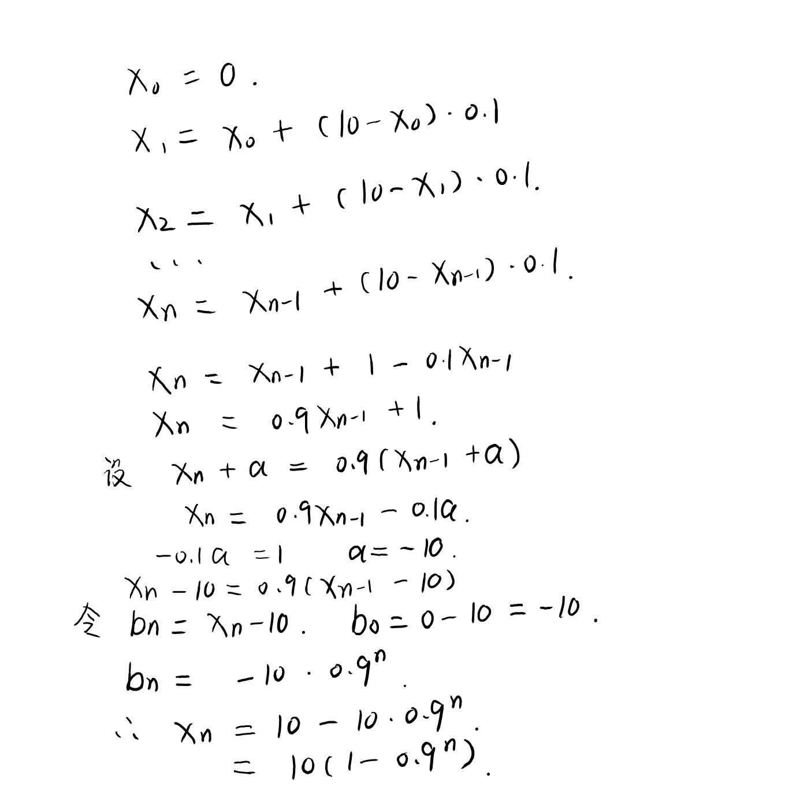

Unity中提供了Mathf类以供计算使用。其中有一个插值函数Lerp,它的功能是：

**Mathf.Lerp(start,end,time) = start + (end - start) * time**

并且，在右边值达到end时Lerp就不会再执行。

那么我们一般在哪使用这个插值函数呢？一般情况下我们都会在Update函数中调用它，来实现两种接近，一种是先快后慢接近，另一种是匀速接近，这可以用于敌人追踪我们或者其它需要用到一个物体接近另一个物体的情况。

我们先看如何实现先快后慢接近：

```c#
using System.Collections;
using System.Collections.Generic;
using UnityEngine;

public class FollowCube : MonoBehaviour
{
    public Transform target;
    public float moveSpeed;
    
    private Vector3 pos;
    private float time;
    // Update is called once per frame
    void Update()
    {
        pos = this.transform.position;

        pos.x = Mathf.Lerp(pos.x, B.position.x, Time.deltaTime * moveSpeed);
        pos.y = Mathf.Lerp(pos.y, B.position.y, Time.deltaTime * moveSpeed);
        pos.z = Mathf.Lerp(pos.z, B.position.z, Time.deltaTime * moveSpeed);

        this.transform.position = pos;
 
    }
}

```

在上述代码中，我们定义了target作为追踪的目标，我们将这个脚本挂载在需要追踪别人的物体上（比如敌人）。同时我们定义了moveSpeed用于控制追踪者的移动速度。

我们重点关注Update中的内容。注意到首先我们让pos获取了当前物体的位置信息，之后我们分别对其x,y,z方向上的值进行了插值函数运算，因此我们仅关注x方向即可。

**pos.x = Mathf.Lerp(pos.x, B.position.x, Time.deltaTime * moveSpeed);**

这句代码的功能就是 pos.x = pos.x + (B.position - pos.x) * Time.deltaTime * moveSpeed;这是什么意思？两边的pos.x相消去？当然不是，这是一条赋值语句，左边的为新的pos.x,而右边的是上一次Update结束剩的pos.x。用数列可以很好的理解这一点，例如左边是第n次Update后的x(n),那么：

**x(n) = x(n-1) + {[B.position.x - x(n-1)] * Time.deltaTime * moveSpeed}**

我们不妨设B.position.x = 10,moveSpeed = 10;这表示目标在x方向上与我们的距离是10，但是请注意，假设我们的Update函数是以100Hz进行帧更新，那么Time.deltaTime = 1/100,也就是0.01s,moveSpeed = 10,我们可以将上面式子化为：

**x(n) = x(n-1) + {[10 - x(n-1)] * 0.1}**

这是一个典型的高中数列求解题，我们通过下述操作来得到x(n)的表达式：



这样我们就得到了x(n)的表达式，我们可以发现这是一个幂函数。同时我们可以做出它的图像：


这里的n随时间变化而增加，我们可以看到，这个函数明显是增长先快后慢，也就是导数先大后小的，而且无论n多大，x(n)永远是不会达到10的，这用极限的知识可以很容易去理解。那么这在我们的Unity中达到的效果就很明确了，就是让物体先快后慢地去接近另一个物体。不过有的人可能会问这不是永远到不了嘛，其实由于浮点数是有精度的，最后我们是可以近似看成到达的。

关于这里的moveSpeed的具体含义，大家可以具体去推导一下。

下面我们来看一下另外一种匀速接近是怎么实现的：

```c#
using System.Collections;
using System.Collections.Generic;
using UnityEngine;

public class FollowCube : MonoBehaviour
{
    public Transform target;
    public float moveSpeed;

    private Vector3 pos;
    private Vector3 TargetNowPos;
    private Vector3 startPos;
    private float time;

    void Start()
    {
        time = 0;
        TargetNowPos = target.transform.position;
        startPos = this.transform.position;
    }
    // Update is called once per frame
    void Update()
    {
        if (TargetNowPos != target.transform.position)
        {
            time = 0;
            TargetNowPos = target.transform.position;
            startPos = this.transform.position;
        }

        time += Time.deltaTime;
        Debug.Log(time);
        pos.x = Mathf.Lerp(startPos.x, TargetNowPos.x, time);
        pos.y = Mathf.Lerp(startPos.y, TargetNowPos.y, time);
        pos.z = Mathf.Lerp(startPos.z, TargetNowPos.z, time);

        this.transform.position = pos;
    }
}

```

我们先不看if的内容，先看：

**pos.x = Mathf.Lerp(startPos.x, targetNowPos.x, time);**

这里是让pos.x = startPos.x + (targetNowPos.x - startPos.x) * time。

startPos是物体一开始的位置（先假设我们不会中途改变它），targetNowPos是目标的位置，我们也假设从开始到结束我们都不去改变它。那么我们可以看出，这个式子中的变量只有time一个了。我们在每次Update中对time执行：

**time += Time.deltaTime;**

我们可以看到，实际上time是随Update的次数线性增长的，也就是说time是随时间线性增长的。在Lerp函数中，当startPos.x + (targetNowPos.x - startPos.x) * time = targrtNowPos后就会停止改变pos.x。这样我们看到的效果就会是物体匀速接近目标，并且到达后停止。

好，到这里看上去就圆满了，但是我们还有一个问题，就是当我们在程序开始之后如果移动了target或者我们的物体，我们就会看到，由于time已经增加了很久了，所以在公式

**pos.x = startPos.x + (targetNowPos.x - startPos.x) * time**

中time不是从0开始的，这就会导致移动后pos.x和startPos.x是不同的，这时候赋值就会导致我们的物体出现瞬移的情况。为了避免这种情况出现，我们必须判断，如果target的位置改变了，我们就需要更新TargetNowPos,并且将Time置零，更新startPos为为物体现在的位置。

当然大家可能会问，当target不变的时候改变物体位置为什么不做判断呢？大家可以运行一下上面的代码，其实你会发现你无法改变物体的位置，因为即使你快如闪电，每一次Update之后就立刻将你的位置恢复到你修改前的位置了（准确来说应该是修改前位置再经过一次Update的结果）~

当然，其实我们一般不会使用Mathf中的Lerp插值函数去设置三维物体之间的跟踪，我们一般会将其用于做一些颜色的渐变之类的效果，因为事实上Mathf中的Lerp函数只能修改一维的量：

**Mathf.Lerp(float a,float b,float time);**

要修改position的话只能对其x,y,z分别进行修改，这是很不方便的。事实上Vector3类中为我们提供了一个专门用于三维向量的Lerp函数：

**Vector3.Lerp(Vector3 a,Vector3 b,float time);**

这个函数只要我们输入两个Vector3的结构体，就可以实现三维向量上的上述计算，对于三维物体的跟踪，我们一般都会选择后者，但是实现方法和Mathf中是一模一样的，下面是参考代码：

```c#
using System.Collections;
using System.Collections.Generic;
using UnityEngine;

public class FollowCube : MonoBehaviour
{
    public Transform target;
    public Transform A;
    public Transform B;

    private Vector3 startPos;
    private float time;

    private Vector3 TargetNowPos;

    // Start is called before the first frame update
    void Start()
    {
        startPos = B.position;
    }

    // Update is called once per frame
    void Update()
    {
        //1.先快后慢
        A.position = Vector3.Lerp(A.position, target.position, Time.deltaTime);

        //2.匀速
        if(TargetNowPos != target.position)
        {
            TargetNowPos = target.position;
            time = 0;
            startPos = B.position;
        }
        time += Time.deltaTime;
        B.position = Vector3.Lerp(startPos, TargetNowPos, time);

    }
}

```

注意这个脚本不是挂载在物体上的。