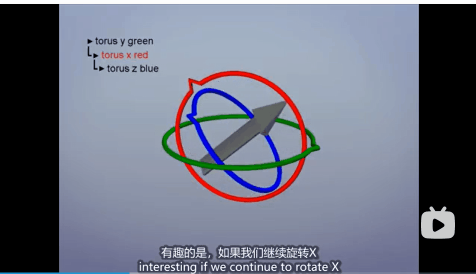

unity中，要进行旋转操作的时候，经常用到的是 **`Transform.Rotate`** 的方法，例如：

```c#
public class Rotator : MonoBehaviour
{
    void Update()
    {
        // 每帧旋转5度
        transform.Rotate(new Vector3(0, 5, 0) * Time.deltaTime);
    }
}
```

这种旋转方式也就是平时经常提到的欧拉角旋转，这种旋转的本质其实是利用了矩阵的乘法。以二维空间为例，我们可以发现，对于二维空间的一个点（我们将它的坐标表示为列向量），对其进行一次矩阵的乘法，可以将其成功的旋转。


这里的矩阵，实际上就是绕着原点旋转一定角度的旋转矩阵。当然，在实际使用时，为了统一旋转和平移操作，我们会使用齐次坐标表示法来进行延拓，不过这不在我们讨论旋转的范畴当中。

同理，我们可以将其拓展到三维，从而推出分别绕着三个轴的旋转矩阵：


但是，这样的操作是存在问题的，最典型的问题就是万向结死锁的问题，也就是当一个轴旋转了一个角度之后（例如90度），会造成其它两个轴重合的情况，此时如果我们再对两个轴进行旋转操作，会发现结果是一样的，此时我们就会丧失一个维度的旋转。



为了解决这个问题，我们就需要引入四元数的概念了。

首先，四元数并不是生来为了解决三维旋转，而是它的性质非常有利于表达旋转信息（后面会详述），所以了解四元数的性质要先于了解四元数在旋转中的应用。至于四元数替代欧拉角等形式，就需要牵扯到一些别的知识点，我先罗列一下四元数相比其他形式的优点：

- 解决万向节死锁（Gimbal Lock）问题
- 仅需存储4个浮点数，相比矩阵更加轻量
- 四元数无论是求逆、串联等操作，相比矩阵更加高效

所以综合考虑，现在主流游戏或动画引擎都会以缩放向量+旋转四元数+平移向量的形式进行存储角色的运动数据。

我们先看一下欧拉公式：


 正如复数是有一个实部和一个虚部组成的，那我们将一个虚部换成三个虚部，即两两相交{i, j, k}。 


 其中n为三维的单位向量，i²=j²=k²=i·j·k=-1。这便是四元数的常规表达形式，不过单位四元数是有一大堆的约束的，并不是所有四维向量都是四元数。 

（待更新）