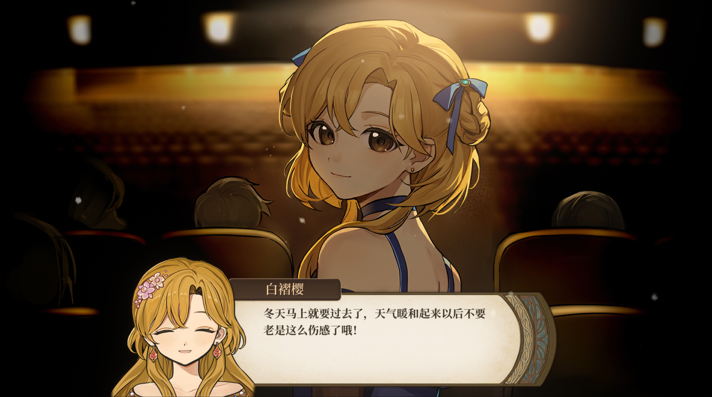

能有幸了解到这款游戏，是在刷IT之家时看到《火山的女儿》即将登录Switch平台的消息后，突然对这款国产养成类游戏产生了浓厚的兴趣。当然，我没有等到登录Switch平台的那一刻，而是趁着steam上打折，不到30元拿下。经历了10个小时的游玩后，通关了一周目，也颇有感受，在此写个简评来分享一下。

说实话，在上大学后，在steam上就没玩过国产游戏。而此次游戏也据说是两位游戏制作人的处女作，第一次制作游戏就能做出质量这么上乘的游戏，完全刷新了我对大部分国产游戏“只会套皮赚快钱”的刻板印象，让我感到我们的游戏确实已经有了很大的发展，在此必须要对这两位制作人献上我崇高的敬意。

**《火山的女儿》算是一款经典的养成类游戏，**用三个字概括就是“养女儿”。玩家将扮演一位老父亲的角色，通过各种选择，包括为女儿安排课程，带女儿参加各种活动，购买物品等等，将女儿培养长大。乍一听好像是个很老套的游戏玩法，而事实上就是很老套，这种游戏题材在很多年前就有很多游戏做过了，但是我也可以很负责任地说：我都没玩过。对于我这种Z时代，或者大多数Z时代的人来说，我们可能确实很少接触这类题材的游戏，所以尽管《火山的女儿》在此类游戏中并不是开创性的，但也算第一次给我们带来了这种快乐。我想这也是这款游戏能爆火的原因。

**当然，除了“养女儿”的吸引力之外，精彩的立绘也是让我立马产生了入手的想法的另一大原因。**不得不说，中世纪的背景加上这种温馨可爱的画风，以及游戏中精美的CG，就是抛开玩法其他不说，都是非常值得了的。画风不能说精致，但却有一种恰到好处的美感，和整体UI的设计结合的浑然一体，很戳我的审美。而且服饰也都非常精美（没错我就是大部分钱都给女儿买衣服买了的购衣狂魔），每一套衣服都有不同的风格，而且还有着不同的属性加成能力（又为多买衣服找到了借口）。

**在音乐方面**，整个音乐的基调都是十分的温馨、缓慢的，除去一些战斗场景外，节奏都非常的平缓，虽然没有什么印象特别深刻的节奏，但是作为休闲游戏的配乐来说，还是十分应景的。

**当然游戏的核心还得是玩法和剧情。**先说玩法，《火山的女儿》采用的并不是一种线性推进的玩法，而是将游戏划分为“回合制”，在每一个回合内，玩家可以通过自己的喜好完成一系列的操作，当然很多操作都会受到“行动点”和金钱系统的制约，如何合理地分配资源，将女儿培养长大，是玩家在这个游戏中所面对的最大问题，也是本游戏的核心玩法。

**当然，除了回合制之外，游戏中的许多“益智小游戏”也设计得十分巧妙，**最能体现出作者特色的小游戏就是当演员选台词了，例如你需要在三局台词中选出“最能体现出角色绝望”的一句台词，好家伙直接把阅读理解送上了游戏属于是。当然，设计的确实不错，有挑战性，但又不至于是那么难的问题。我不禁想以后游戏是不是都可以直接改变初中高中的各种题目了。

**最后就是故事情节方面了，**说老实话一周目玩完下来，这方面给我的感触并不是非常深，因为我玩游戏的大部分时间都直接一路SKIP了，而且我不跟攻略走触发的只是一个普通结局而不是“真正结局”，所以很多作者精心设计的暗示我都是没有发掘的，这些东西都是在通关一周目后在网上看到的。就我自己的感触来说，这个游戏有种“突然就结束了”的惆怅感，或者说是让我提前感受到了“女儿长大了，该离开父母了”的惆怅感和失落感。不过，在观看网上社区的讨论之后，各种“真结局”的信息又激起了我开启二周目的浓厚欲望。其实我一直觉得游戏的社区讨论也应该是游戏很重要的一环，原神就是一个很好的例子，一个人毕竟不可能一次玩完所有彩蛋，但是通过网上的视频和介绍却可以激起玩家继续玩下去的欲望。

**最后说一点不好的地方，**就是这款游戏设计的和别人对话获取好感的功能实在是太让人难受了，这就导致我每一轮都得和所有人聊一次天，或许作者是想通过这样来把信息都灌输给我，但是U1S1下次还是设置个感叹号比较好，不然强迫症每次都得全部点一遍。

当然，对于该游戏我整体是非常喜欢的，特别是养女儿这个题材真的非常戳我。套用作品的原话，**很感谢你能成为我的女儿！**

