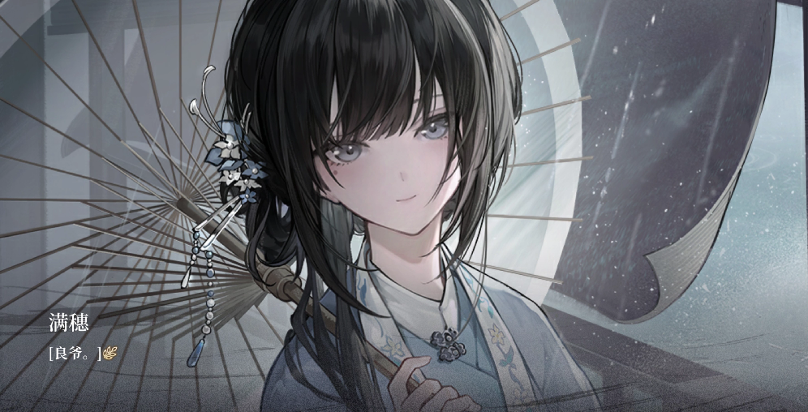

早在好几个月前，零创游戏发布视频介绍这款游戏的时候（2023年11月），我就关注了这款比较别致的游戏。当时给我留下最深的印象就是”在明末送外卖“这一点，以及女主的画风真的很不错。在最近几天，这款游戏正式推出后我也是立刻就入手推完了剧情。

先说结论：这是近几年难得的国产文字冒险游戏，由于题材原因，我认为这不能算是一部传统意义上的galgame。但是在我玩过的文字冒险游戏当中，这已经算是非常别树一帜的题材了。

故事发生在明末时期，天启年间，京都天降异象，发生了一场大爆炸， 半径大约750 米，面积达到2.23平方公里，共造成约2万余人死伤 。而男主在这场爆炸中失去了自己的父亲，从此家破人亡。雪上加霜的是，当时政府拨下来的钱，还被贪官污吏占去，男主最后什么都没有得到，因此也做起了杀人放火的勾当，成为了一名强盗。

由于一次“偶然”，男主和搭档“舌头”一起接了一个送四个女娃子去洛阳给人收养的活，报酬出奇的高。而女主也作为一个“不会说话的女娃子”登场了。但是第一晚，这个女娃子就乘着男主不注意想暗杀男主（当然我也是第一次选就直接寄了，不过根据后面的情节来看这可能还是更好一点的结局）。被男主挡下后，突然变了一副模样，完全变成了一个“单纯害怕的小孩子”，说实话，在这里我心里是非常膈应的，毕竟是想取我性命的人，我还把她当成小孩子一样？必然是不可能的。但是后面作者也用了相当长的篇幅来“迷惑”我，通过编造要去洛阳城杀豚妖的故事，成功将我的关注重点转移了。这也是作者对于玩家最大的一次“欺骗”，这第一次刺杀也是这个游戏里面最大的一次铺垫。

之后的剧情，就是带着女娃子们一起四处奔波了，这一段剧情我认为是沉浸感很足的，中间几次小高潮，例如杀“舌头”，做的都非常有代入感，已经感觉到手上沾满鲜血的自己了。

当然，我认为这个游戏最大的亮点，最为精彩的部分，必然是满穗的回忆部分。使用牛皮纸背景加上线条画风，我愿称之为神之美术！叙事的节奏也把握的非常的好，从一开始的一家人幸福的生活在一起，到后面逐渐缺少粮食，最后出现一家人相食的惨状，给人留下的印象是无比深刻的，露骨地揭露出了人在极端饥饿下兽性的爆发，当然也是用了一些艺术加工的表现方式，但是由于现在的大家本来都没有经历过饥荒的惨状，这样的表现方式还是很能在玩家心造成很大的冲击的。

（这个回忆里面的满穗真的好像小费伦啊）

铺垫是这个游戏另一个亮点之一，在很多地方，甚至还没直接告诉你，你就可以猜个差不多大概了，例如回忆中满穗吃了弟弟和母亲（神仙肉），发现满穗的父亲其实是自己杀的等等。当然很多地方的铺垫也是要等到最后揭晓的时候才给人一种“恍然大悟”的感觉。

游戏中设置的悬念也同样推动着玩家不断去探索真相，其中一个就是满穗的回忆，就算忽略掉主线，我认为满穗的回忆也足够推动着玩家往前探索了，这个女娃子身上有着太多谜底：她是如何在饥荒中走出来的，她的姐姐在哪，她出去的几年到底做过了什么。我在玩的时候也遇到了很多疑惑、觉得不合理的地方，例如在满穗提出煮了舌头的时候，我都吓了一跳，一个女娃子怎么能这么面不改色地说出、做出这种事情，之后还表现得像一个小孩子一样？当然，在玩完之后，还是会恍然大悟，原来这个女孩子早已目睹过更加残酷的地狱。

当然，这个游戏也有不少不足之处，比较明显的就是一些结局有种非常牵强的感觉。作品的“true end”，两人在最后都活了下来，单纯的cp党看来，这确实皆大欢喜，但是万不可忽视了一件事，就算天道如此，满穗的父亲，以及一家人，还是被男主直接害死的，满穗就算不替父报仇，和良“一起快乐地生活下去”这种事情，无论如何还是令人反胃的，在我看来，这个结局明显有着过度理想化的倾向，已经沾上了无数的鲜血，到最后还happy ending这种事情，有种“既要又要”的感觉，甚至感觉是先画好了这幅画然后想为她强行加一个结局一样。

另外一个已经被众多网友吐槽过的点就是配音问题了，说实话hanser的配音确实是有不少问题的，代入环境来看问题就更多了。但是瑕不掩瑜，这依然是我近几年玩过的非常出色的文字冒险游戏之一。而且成功地引发了我对于饥荒的思考，我们这一代人从来没经历过吃不饱饭的情况，对于饥荒只有在书上看到的一串串数字的理解。但是不能忽视的是，饥荒在整个人类历史上就像家常便饭一样，当历史书中几个“出现了人吃人”的大字，以游戏的方式展示在我们面前时，给人的震撼还是无与伦比的，我想这也是游戏的意义所在吧。

希望零创游戏能做出更加精彩的作品，也希望中国游戏产业蒸蒸日上！

