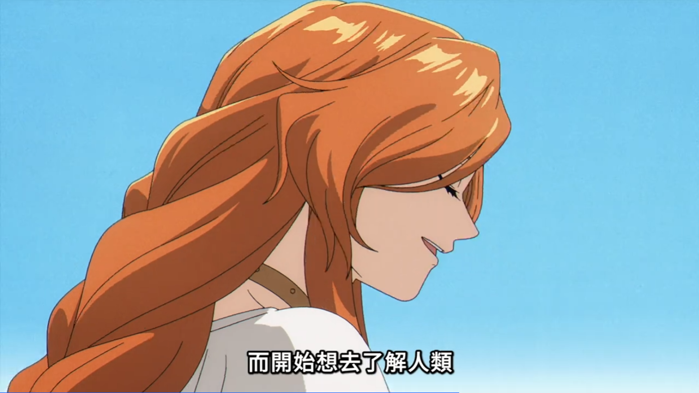
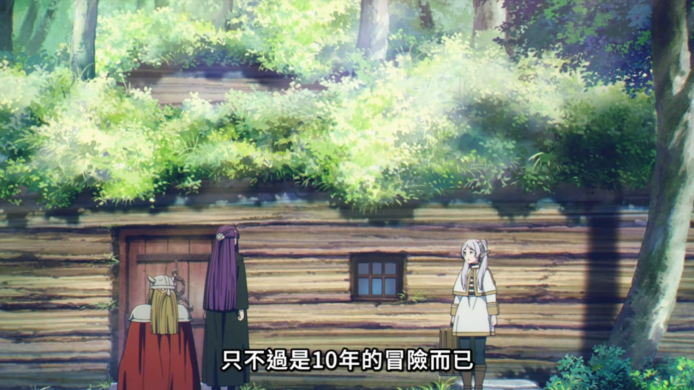

“勇者死后，我开始爱上他。”

作为一位没看过漫画的动画党，就这四集（短片）的观感来说，这是一部相当平淡的作品。

所谓“平淡”，并不代表平凡。

故事的主角，芙莉莲，是一个活了一千年以上的精灵。不过不同于大多数作品中所描绘的老奸巨猾的千年妖精形象，我们的芙莉莲总是一副不谙世事的可爱模样，完全没有什么心机的样子。对于芙莉莲看来，由于拥有着极其漫长的时光，她对于时间的认知与寿命短暂的人类相比有着很大的差异。而这种对于时间的认知上的差异也决定了整部作品的基调（当然我还没看漫画，只对动画播出的内容做评价），整个短篇就像是浸透在芙莉莲的视角一般，站在芙莉莲的角度带着我们经历整个故事。

故事的开场就展示了芙莉莲和其他三位勇者一起打败了魔王之后返回城镇的画面。对于绝大多数冒险故事来说，这可能是结局的，但对于这个故事来说却是开始。在打败魔王后，有着极长寿命的芙莉莲继续外出旅游，搜集魔法。但是这一离开，就是五十年——对于芙莉莲来说，这五十年只不过是弹指一瞬间，但是对于其他三位伙伴来说，却是几乎整个后半辈子。五十年后，当曾经的讨伐魔王四人组再次团聚，其他三人都已经老去，而芙莉莲却依然是当初那个模样。在这次团聚后不久，伙伴之一的欣梅尔离开了。作为一同旅行了十年的伙伴，可以看出欣梅尔对于芙莉莲有着非同一般的情感，这在短片中芙莉莲的回忆中可以明显地感受到，但是在活着的时候他却什么都没说，只是默默地为芙莉莲保存了一根龙角五十年——这是他“最重要的伙伴”托付他保管的。但是对于芙莉莲来说，一切好像显得都非常平淡，一同旅行的十年也好，离开的五十年也好，都不过是她漫长人生的一个小小的片段。在这么“短”的时间，她根本没能好好地，更多的了解她的同伴们。在旷别半个世纪之后，再见已是阴阳两隔。看着入土的同伴，一种从来不曾在她生命中出现过的情感充斥着芙莉莲的心头——既然彼此的时间本就不同，为什么没能更加努力地去了解？

“总有一天，你会犯下大错，而开始想去了解人类。”

不论是千年前的师傅，还是一同旅行的同伴们，他们都显然看出来了芙莉莲内心隐藏的某种情感，那就是对于人类——这种在寿命上与她完全不对等的生物的爱，失去对时间的敬畏，后果也将是失去对爱的理解。但是她自己却浑然不知这一点。短片的最后，在师傅千年前的指引下，芙莉莲决定沿着当年的轨迹，再次走完四人一同走过的道路，去发现自己心中的这份感情。

这个故事最为巧妙的地方就在于，可以将芙莉莲的旅行分为两条线，一条明线是她此时此刻正在和费伦等人一起的旅行，而另一条暗线则是当初走过的路，以及对欣梅尔等人的感情。这两条线交织在一起，巧妙地将暗线埋藏在明线之中，在回忆中塑造人物，是一种十分高明的手法。

在故事一开始，作品就十分轻描淡写地描绘了勇者的死亡，这种令人感到悲伤的事情，却用这种平淡的笔墨去描绘，在此我们也能看出芙莉莲的态度——对于人类的死亡早已是司空见惯的常态，没必要去特别在意。所以说这整个故事就像是加了芙莉莲的滤镜一般，有一种“哀而不伤”的意境。“哀”在于，曾经的伙伴们都已经离开自己，曾经的孩童们都已经老去，而之所以不“伤”，是因为芙莉莲的旅途还在继续，还有费伦等伙伴的陪伴，他们还有着无限的未来需要去探索，死与新生交替，何尝不是生命的意义。在观看时，读者也不自觉地代入其中，仿佛跟着芙莉莲一起去寻找内心的情感一般，去面对“衰老，死亡，爱”这个终极命题的答案。

老实说，因为还没看漫画，对于故事的后续我也没有什么了解，只是听说后期作者发挥稳定，这样的话，我还是相当期待这一部“哀而不伤”的作品能给大家带来怎样的惊喜。

