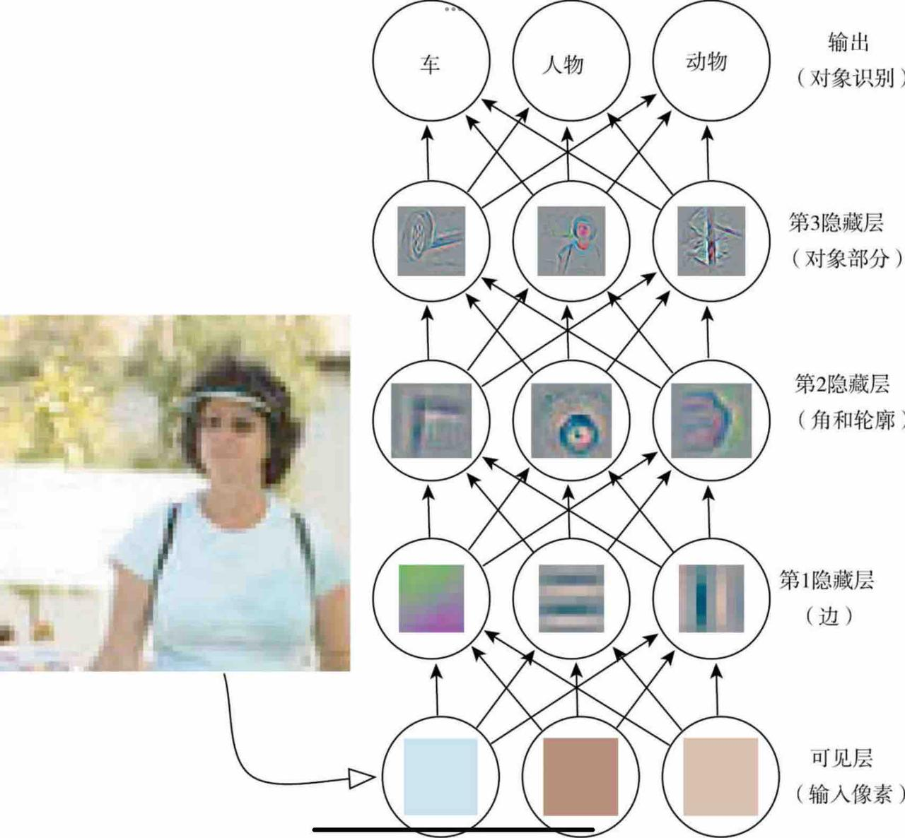

# 引言

如果说近些年最火的话题，人工智能无疑是其中之一，ChatGPT的成功应用使得人们第一次真正意识到了AI的强大以及发现AI已经发展到了如此强大的地步。长久以来，抽象和形式化的任务对于人类而言都是最困难的脑力任务，但讽刺的是这对于计算机来说却是最容易的，alpha GO早已证明了这一点。相对的，对于人类来说最为简单的主观、直观的非形式化内容，对于计算机来说却是最为困难的，因为我们的此方面感觉来源于日常生活中的大量积累，而计算机要想达到同样的效果，必须至少接受相同的知识，这也是为什么在人工智能概念出现后几十年内技术都没有什么显著的进步——我们缺乏足够的数据集来训练我们的模型。但是现在不一样了，互联网时代的到来给人们带来了空前的数据量，几乎可以涉及到现代社会的方方面面的海量数据无疑成为了训练模型的绝佳来源，也就是在此环境下，大语言模型ChatGPT应运而生。

早期的人工智能项目采用知识库方法，即将世界的知识用形式化的语言进行硬编码来让计算机理解，但是都失败了。这表明AI必须具备自己从原始数据中提取模式的能力，这种能力我们称为机器学习。对于机器学习来说一个重要的点是对于给定数据表示形式的依赖，我们需要先提取出一个合适的特征集，然后才能将特征集提供给简单的机器学习算法。例如，在使用逻辑回归判断产妇是否适合破腹产时，AI系统会依赖几条相关信息，如是否存在子宫疤痕，但是如果将病人的核磁共振扫描图交给AI，它将无法作出任何有效的预测，原因很简单，在AI看来核磁共振扫描图就是一堆像素点，要想在像素点和并发症之间作出逻辑判断是不可能的。

然而，实际上对于很多任务来说，我们并不知道应该提取哪些特征。例如，我们想让机器判断一张图片中是否有汽车，我们很难根据像素点来描述汽车像什么，因为一个汽车的图像很可能因为环境和拍摄角度的不同而表现的很不一样。解决这个问题的方法是表示学习。一个典型的例子是自编码器，自编码器由一个编码器和一个解码器函数组合而成，编码器函数把输入数据转换为一种不同的表示，而解码器函数将这个新的表示转换为原来的形式，这样我们就得到了一个新的表示。我们希望新的表示能尽可能多的保留信息并且有更好的特性。

在设计用于学习特征的算法时关键的地方是分离出能解释观察数据的**变差因素**。但是实际的困难是多个变差因素可能影响到我们能观察到的每一个数据。例如，一张夜间拍摄的红色汽车的图片可能使得很多像素点都很接近黑色，而拍摄视角对于汽车轮廓起着决定作用。而对于识别汽车轮廓来说，我们并不想知道是哪个角度拍摄的，我们只想知道图片中是不是有汽车，这就理清变差因素并且忽略我们不关心的因素。

但是，我们很难从原始数据中提取如此高层次抽象的特征。对此，我们引入了**深度学习**来通过较简单的概念构建复杂的概念。例如，我们要识别人，可以发现人的轮廓和边角是由边线定义的，边线在可见层是由像素点组成的。在下图中，第一层可以通过比较相邻像素点点亮度来识别边缘，而有了第一层描述的边缘，第二层可以容易的搜索可识别为角和轮廓的边的集合。有了对于角和轮廓的图像描述，第三层就可以找到特定轮廓和角的集合识别为对象部分。最后通过对象部分就可以确定图像中存在的对象。

  

目前主要有两种度量模型深度的方式。第一种是基于评估架构所需执行的顺序指令的数目，例如在上述例子中深度就为4。另一种是在深度概率模型中使用的方法，它将描述概念彼此如何关联的图的深度视为模型深度，例如，在概念的图仅包括两层时，如果我们细化每个概念需要N次计算，那么计算的图将包括2N层。

# 深度学习的历史趋势

虽然深度学习似乎是近几年才出现的东西，但是其历史发展却可以追溯到上世纪40年代。深度学习的最早雏形出现在控制论中。我们今天看到的最早的学习算法，其核心都是在模拟生物学习。当时的一个重要思想是大脑作为很好的例子证明智能行为是可能的，那么只要我们能在算法上模仿大脑，理论上我们就可以制造出"人工智能"。一个代表性的例子是**线性模型**，线性模型希望学习一组权重来计算他们的输出。但是它具有很多的局限性，最著名的就是他们无法学习异或函数（1），这也导致了第一次神经网络大衰退。自此之后神经科学也不再是深度学习领域的指导，而只作为灵感来源。

80年代的联结主义的核心思想是，当网络将大量简单的计算单元连接在一起时可以实现智能行为。其中分布式表示的概念在今天仍然具有非常重要的意义。其思想是，系统的每一个输入都应该由多个特征表示，并且每一个特征都应该参与到多个可能输入的表示。例如，假设一个能识别红色，绿色和蓝色的汽车，卡车和小鸟的系统，一种表示输入的方法是使用九个神经元，分别对应红汽车，绿汽车，蓝汽车，红卡车等。改善的方案是使用六个神经元，三个神经元描述颜色，三个神经元描述对象身份。然而，在当时由于训练量的匮乏，深度学习在与机器学习的其他领域如核方法和图模型的竞争中显得心有余而力不足，这导致了神经网络的第二次衰退。

转折点发生在2006年。人们发现，在八十年代就出现的很多算法现在能工作的非常好，只是当是缺乏数据和硬件来训练而显得效果不佳。但现在不一样了，随着硬件技术的极大进步以及社会数字化带来的海量数据量，我们发现当将训练的样本数量提高到一定数量级时，训练出来的模型的效果将发生质的变化，这也是chatgpt的原理。随着未来训练数据量的近一步提高，我们有充分的理由相信人工智能大模型的精度与能力将上升到一个可怕的程度。

（1）https://blog.csdn.net/maum61/article/details/90287897