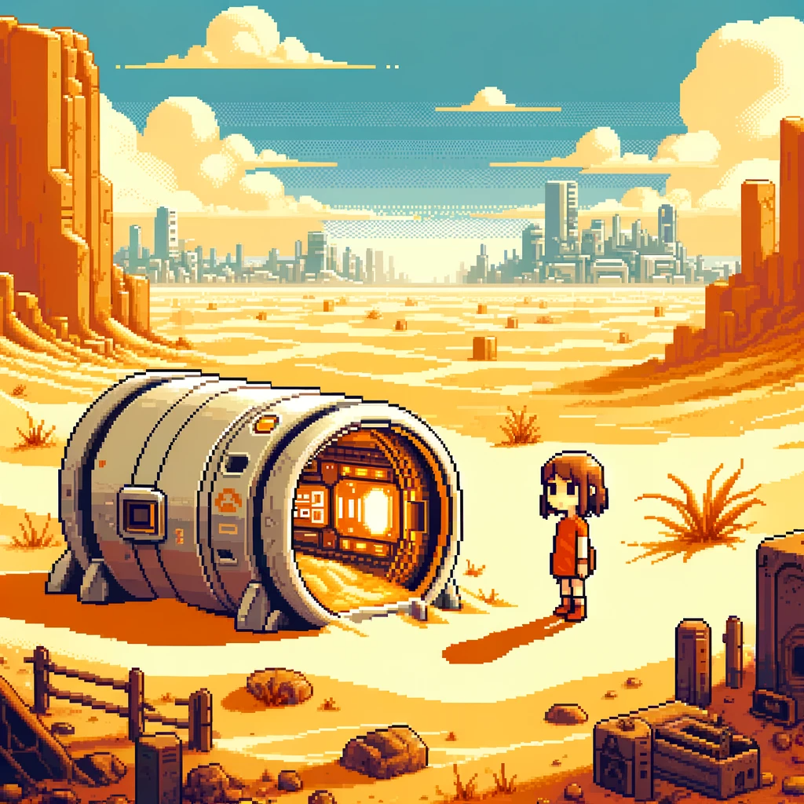
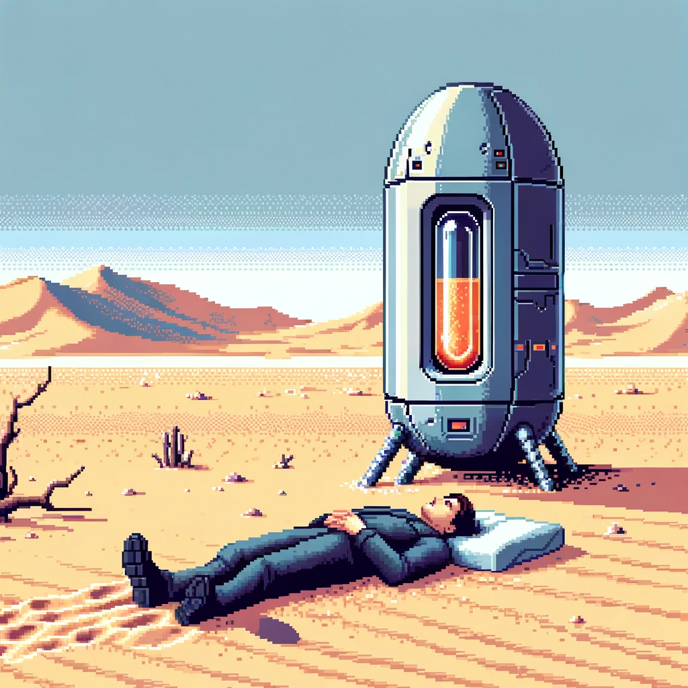
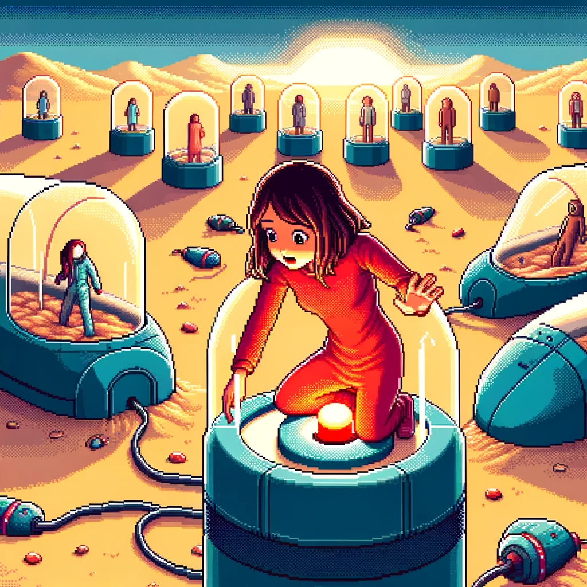

灵感来源于做PlaneFight-NierVer的时候，想起一个名字来表示后续的游戏情节，想来想去起了一个非常中二的名字：LastShojo。之后在交谈的时候，也有了不少想法，也写了一些文案，虽然还没开始做，但先把东西放在这里。

当然，现在决定另外开一个项目，而不是在原来的基础上改了。事实上重新做比改从某种程度上来说还容易些，也更加有趣了。

## 故事背景设定

这是不知多少年后的世界。

【少女】从沙漠中醒来，发现自己已是孤身一人。

这片沙漠，原本也有自己的名字，也曾被称作过“大都市”，那时候，人们都对这里趋之若鹜，这片土地无论何时都是挤满了人。一寸小小的土地，可能就是一个人终身的努力。

但从不知何时起，人们开始厌倦了这种拥挤。外面的人不再想进来，而里面的人也越来越少。人们开始喜欢上一种“胶鼻床”，他们把自己放在里面，一小时，甚至有时候一天都不出来。进去的人越来越多，而他们在里面呆的时间也越来越长......直到有一天，最后一个人进去了，再也没有人出来。

少女不了解这段历史，也不知道自己是不是那“最后一个人"，她甚至不知道自己是谁。她所知道的，是她必须离开这里，但是外面的世界充满了未知和危险，她能看到的，只有眼前的一个个“胶囊”。

## 玩法

游戏类型为横板解谜游戏。

画风十分简洁，是像素风格。

少女能做的事情很少，移动，跳跃，以及唤醒沉睡中的人。

唤醒的人有着不同的属性，例如有的人可以攻击敌人，有的人可以提供防护(少女呆在他身边不会被怪物伤有的人可以修造桥梁.....但也有人充满了攻击性，即使是对柔弱的少女也毫不留情。胶囊中到底是怎样的)人，全看运气了。

那么，加油吧，努力抵达终点，探寻【真相】!

## 概念图

## 结局

### 结局1

“你确定要按下这个按钮嘛？按下它，所有人在使用胶囊中的记忆都会被清除，同时所有胶囊都会自动销毁。干干净净，就像从来没有出现过一样。”

少女点点头。她见到了太多太多沉浸在那个虚拟世界中，不愿回来的人。他们对于被叫醒感到无比的愤怒。但是少女不能理解，她没有去过所谓的“虚拟世界”，也无法想象这些。对她来说，这个世界，就是她唯一的世界，也是所有人的家。大家不应该让这个世界在漫天黄沙中死去，而应该齐心协力，让这个世界再次充满生机。
但尽管如此，一些沉睡者的话还是让少女久久无法忘怀。

“我在那里也有一个家。”他说。“那里视野很开阔，环境也很好。出门不远处就有一条小溪，我没事的时候就在那里钓鱼——哦，我在那里是一名木匠。”

“我有妻子和孩子。每天工作的时间不多，但都是我所喜欢的事情。我的大部分时间都陪着他们，我们会一起去冒险，一起在这美丽的世界到处旅游…当然，我知道对你来说这一切都是【虚拟】的。”
“这所有的一切，不过只是一堆数据罢了…但我确实记得，和妻子的约定，约定好了明天晚上一起去吃火鸡餐…那是我们20年结婚纪念日…”他又看向胶囊，那个已经无法运行的机器，只有少数还发着微光的器件展示着它曾经也【活】过。

“但我再也回不去了，我的世界已经死了。我所爱的人，全部都不会回来了。我并不恨你，只是我没有能力保护好他们，或者说这个世界没能保护好自己…既然你还有梦想，那就去保护你的这个世界吧。**只是假如有一天，有人把你从这个世界‘叫醒’，并告诉你这一切都是虚拟的，也希望你能接受这一切…**”

他死在了胶囊旁，和他的世界一起。少女不太明白他所说的东西，但她心中确确实实开始思考了一些问题。当然，要得出答案，又是在很久很久以后了。

少女按下了按钮，人们带着全新的记忆在睡梦中醒来。他们不记得有过什么虚拟的世界，但他们都保存着之前的记忆。大家齐心协力，终于在这片沙漠之上重建了崭新的城市。不知多少年过去了，许许多多的问题又显现出来。有人贪得无厌地吸取着别人的劳动成果，有人拼尽全力却一无所获。越来越多的人开始埋怨起这个社会，开始诅咒起这篇城市…

当那个胶囊被发明的时候，又是很多年以后的事情了。当然没有人记得曾经的“胶囊”，除了已经变成老太婆的少女。当少女听说这个消息之后，马上联系了这个发明者。发明者也吃了一惊，毕竟这是拯救了全人类的“人类之母”。机器很快调试完成，“少女”戴上了头盔，看着眼前熟悉的机器，想了许多，最终躺了下去。

今夜，希望有个好梦。

（结束）

### 结局2

“你确定要按下这个按钮嘛？按下它，所有人在使用胶囊中的记忆都会被清除，同时所有胶囊都会自动销毁。干干净净，就像从来没有出现过一样。”

少女点点头。她见到了太多太多沉浸在那个虚拟世界中，不愿回来的人。他们对于被叫醒感到无比的愤怒。但是少女不能理解，她没有去过所谓的“虚拟世界”，也无法想象这些。对她来说，这个世界，就是她唯一的世界，也是所有人的家。大家不应该让这个世界在漫天黄沙中死去，而应该齐心协力，让这个世界再次充满生机。
但尽管如此，一些沉睡者的话还是让少女久久无法忘怀。

“我在那里也有一个家。”他说。“那里视野很开阔，环境也很好。出门不远处就有一条小溪，我没事的时候就在那里钓鱼——哦，我在那里是一名木匠。”

“我有妻子和孩子。每天工作的时间不多，但都是我所喜欢的事情。我的大部分时间都陪着他们，我们会一起去冒险，一起在这美丽的世界到处旅游…当然，我知道对你来说这一切都是【虚拟】的。”

“这所有的一切，不过只是一堆数据罢了…但我确实记得，和妻子的约定，约定好了明天晚上一起去吃火鸡餐…那是我们20年结婚纪念日…”他又看向胶囊，那个已经无法运行的机器，只有少数还发着微光的器件展示着它曾经也【活】过。

“但我再也回不去了，我的世界已经死了。我所爱的人，全部都不会回来了。我并不恨你，只是我没有能力保护好他们，或者说这个世界没能保护好自己…既然你还有梦想，那就去保护你的这个世界吧。只是假如有一天，有人把你从这个世界‘叫醒’，并告诉你这一切都是虚拟的，也希望你能接受这一切…”
他死在了胶囊旁，和他的世界一起。少女不太明白他所说的东西，但她心中确确实实开始思考了一些问题。当然，要得出答案，又是在很久很久以后了。

少女最终没有按下按钮。

**“如果你想要完成你的梦想，请不要剥夺他人做梦的权利。”**

那个人的话至今仍在少女心中回响。她不知道别人的梦是怎么样的，但她确实不想再做出让别人困扰的事情了。

不过，这个世界还是有希望的。

“罗伯特”，那个许多年前就坐上了自己的飞船，离开了这个星球的人，这个世界上最后一个不愿意进入胶囊的人。他年轻时是否会和少女一样困扰？他或许也被问过同样的问题，但他的答案却是“我不知道这个世界是否是虚拟的，所以我想自己去探索，直到找到答案，或者走到我生命的尽头。如果我进去了，我就永远找不到答案了。”
罗伯特最终造出了光速飞船，独自一人离开了地球。但人们对他的发明没有任何兴趣。地球外面只有冰冷的荒地，而地球本身就已经快荒无人烟了，为什么还要费劲出去呢？

但罗伯特还保留了一份希望，那就是第二架光速飞船，此刻正在少女的面前。坐上它，少女就能离开这里，驰骋星海，或许有一天，在宇宙的某个未知角落，与罗伯特重新相遇。那时候的他，是否会找到自己的答案呢？

少女不知道，但她毅然坐上了飞船。从此，少女又要开始一个人的冒险了，只不过这一次，她不仅仅是世界上最后一个少女了，而是这璀璨星河中，最后一个少女。

（结束）

