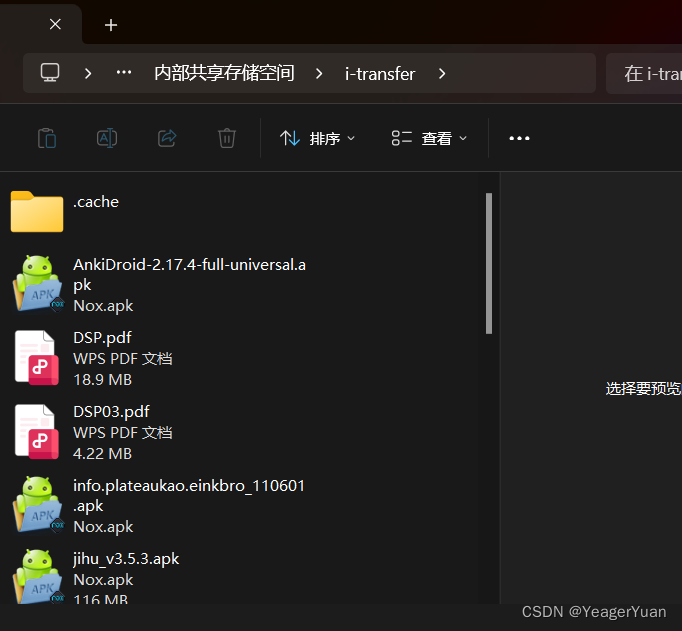
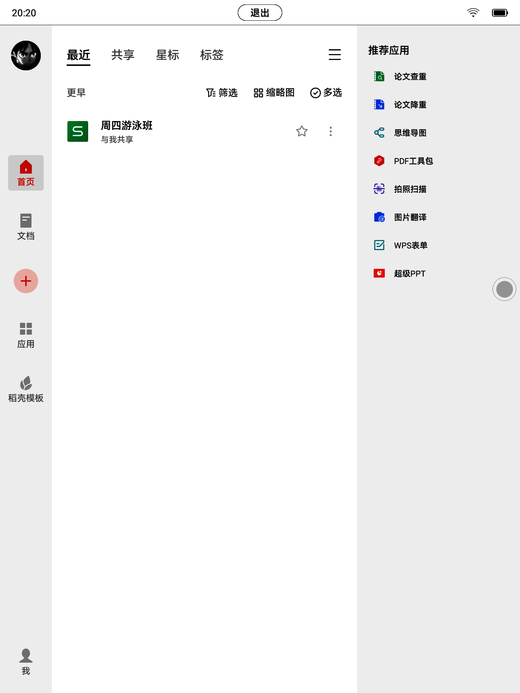
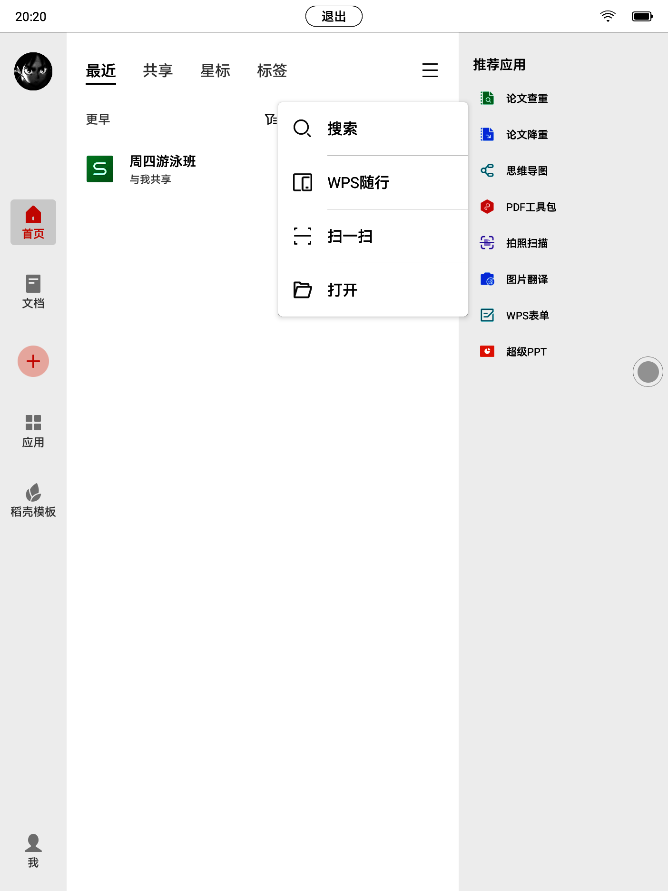
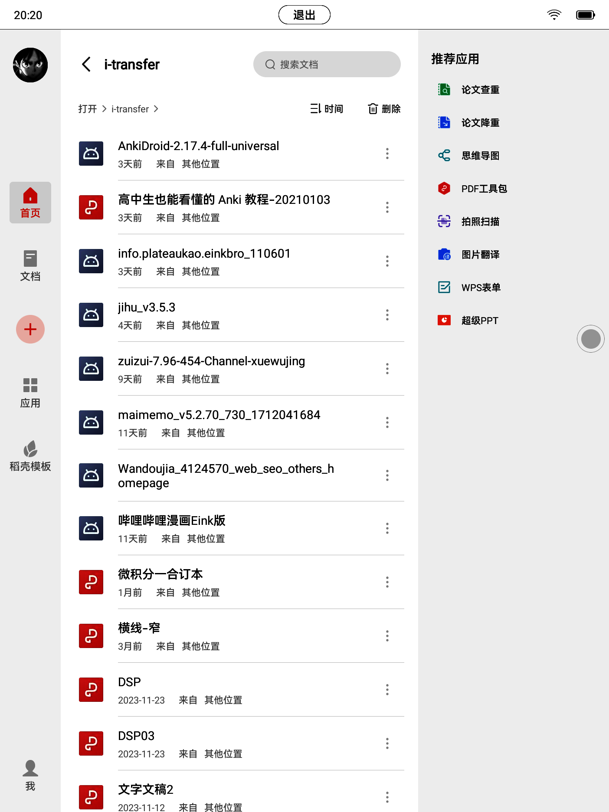
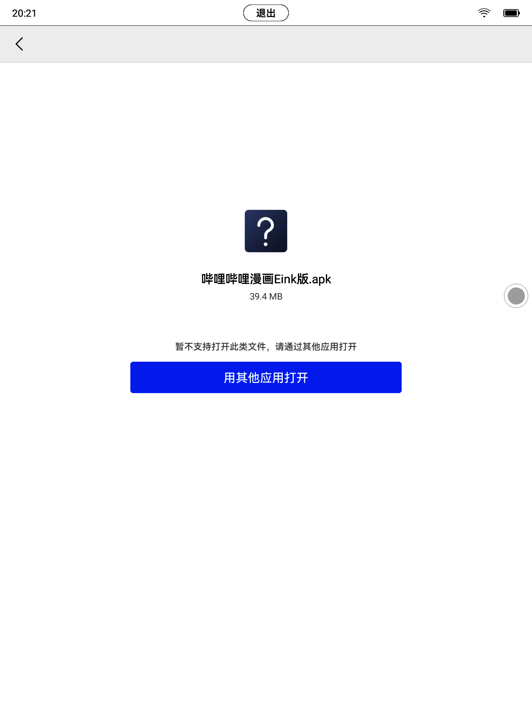
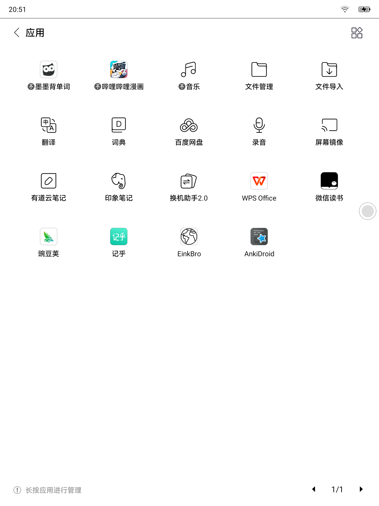

本方法适用掌阅iReader4pro，并且理论上应该可以适配所有掌阅的所有有WPS并且内存足够的机型。

首先，在网络上找到你想要安装的应用的apk文件，这里推荐几个个人觉得非常好用的软件，分别是墨墨背单词，哔哩哔哩漫画（eink版），einkbro(墨水屏浏览器)。

然后，将这些文件移动到iReader文件夹里（我是移动到i-transfer文件夹,也就是微信导入的文件夹，其实在本机其它文件夹也都行，只要WPS能访问到就行）。

然后，就可以拔掉数据线了，后面直接在阅读器上操作就行。

打开iReader里面的WPS（如果没有安装可以先安装）。点击右上角的三条杠，然后点击打开。

进入你放置文件的文件夹，然后点击apk文件。

点击用其它应用程序打开，第一次会向你寻求WPS的存储权限，允许之后再回来点击就行。之后就可以直接安装apk应用了。

 apk文件百度网盘链接：https://pan.baidu.com/s/1msCRs1SG70cfyfHIdzIhRg?pwd=6twf 
提取码：6twf 

