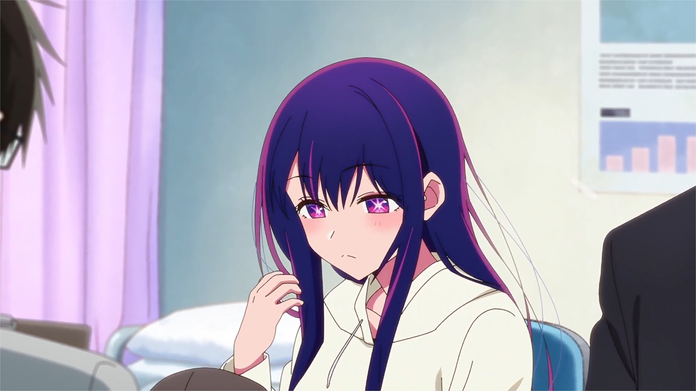
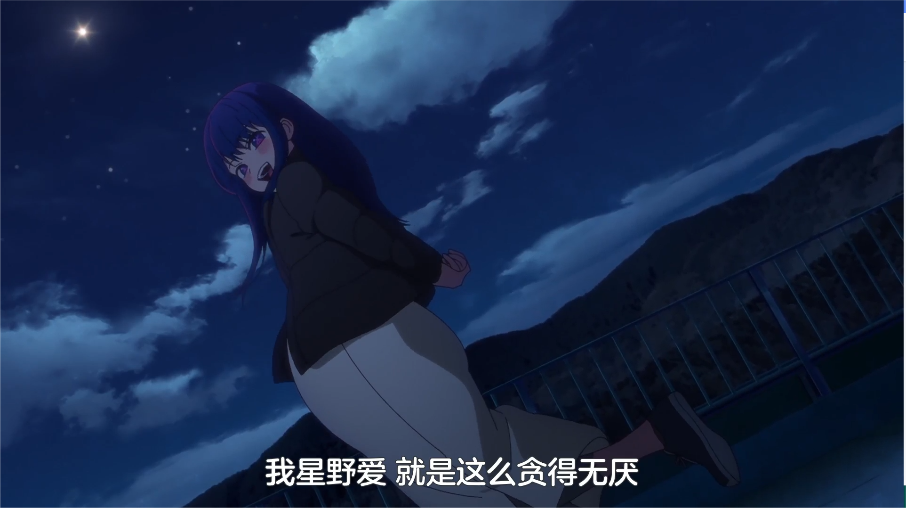

说老实话，在观看《我推的孩子》之前，已经很久没有看过后劲如此之大的动漫了，虽然只是一集单集，但这仅仅80多分钟所展示出来的内容，以及引起的思考，却是让人回味无穷的。影片最特别的一点便是成功塑造出了一个极具特色的“星野爱”的idol形象。我们或许看过很多作品，一些作品可能以生动的剧情闻名，而另一些作品虽然就剧情来说没有什么让人印象深刻的点，但是它们却可以成功塑造出让人难以忘怀的人物形象（例如同样为动画工房制作的小埋形象）。本集可以说是两者兼备，但我认为作品在后者的表现更加令人感叹。就这点来说，即使这集前篇得不到今年的最佳单集（还有巨人的前篇）。也算是近几年塑造人物形象最成功的单集之一了。不得不说赤坂老师的人物塑造能力还是非常一流的，动画工房的制作也是一如既往的给力。
作为本篇的主要角色，星野爱，在这短短的82分钟里，被刻画的形象鲜明，令人印象深刻。就我本人的观感来说，这里的原因可以归结到前后的巨大落差感，在这短短一集中，星野爱给人的印象可以说是180度大转弯的，这无疑使得她的形象十分具有立体感。
作品一开始便介绍了星野爱的大致情况——天生的偶像，万众瞩目的新星，16岁的超级美少女，从各个方面来说都是完美的，遥不可及的存在。而这样的大明星却突然来到了男医生所在的医院，而且居然怀孕了——这里构成了第一次巨大反差。

说实话看到这里我就突然震惊了，一开始看到爱挺着个大肚子，我是拒绝相信她怀孕的——毕竟没有人能接受看到一个16岁的美少女（而且还是一个偶像）怀孕吧。但是剧情却让你不得不相信这就是事实。看到这里我对爱的印象其实就变得非常糟糕了的，确实得承认，在不知道具体原因和背景的情况下，看到这种事情很难不把爱和不良少女联系到一块去。而且爱在之后和医生交谈时所说的话语更是让人难受，“以谎言堆积谎言”，“我星野爱就是这么贪得无厌”，再加上后面医生所表现出来的“无脑粉丝”的形象，可以说一下子就让人想起了现实中令人不适的疯狂饭圈文化以及娱乐圈爆瓜的行为。看到这里，的确很难对爱有一个很好的印象。

之后的剧情便是介绍了比较离谱的转生成偶像的孩子的设定——说实话这个设定一开始确实很令人不适，甚至让我在那里捶着桌子在心里大喊“离谱”。男医生和女患者——这两位爱的狂热粉丝，在转生之后成为了爱的孩子，而他们在这一世依然疯狂的喜欢着爱。这一段剧情可以说是笑点（具有记忆的婴儿确实很搞笑）和背景介绍兼具的。在兄妹搞笑的成长剧情中，成功穿插了霓虹偶像界的现状——生存困难，被资本所控制，没有资源的偶像基本上没有任何机会。这段介绍让人们一改以往对idol光鲜亮丽、吃喝不愁的刻板印象，认识到了这也是一个在资本运营下险象环生的危险行业。在这个大背景下，我们再次审视星野爱——这个一无所有，靠自己的天赋和拼了命的努力取得如此之大的成就的偶像，确实很难不心生敬佩。
.png "")
不过更大的转折点在于星野爱对待两个孩子上。爱是一个孤儿，从小就没有自己的家庭，是一个从小就没有得到过他人的爱的人。从心理学上来说，这样的人，确实不懂如何去爱别人，体会不到这种感觉。她的名字叫爱，却一直不懂什么是真正的爱，这可能也是一种讽刺吧。
但是，我们可以看出，在爱的内心深处，却是一直渴望着爱的。也如她所说，“我不懂什么是爱，如果谎言是一种爱，那么我将毫不犹豫地去说谎”。这样的星野爱，一直重复着“我爱你”的谎言，期待总有一天这一切谎言都会变为事实，看到这里，确实让我沉默感叹了很久。
.png "")
也正是因为从来没有过自己的家庭，所以星野爱一直渴望着自己的家庭——这便是她生下这两个孩子的最大动机。这和本集的前面相呼应，一下子消除了之前的不良印象。而事实证明，就是这样一个“不懂爱”的爱，努力工作，努力赚钱，认真地照顾着两个孩子，甚至因为听到了两个孩子对于生父的谈话，就直接去找前男友让他来看望两个孩子（这在之后也为爱的死亡埋下了隐患）。作为一位母亲，星野爱已经做到了极致。她是最不懂爱的人，但她为了爱所做的事情，却远远超过了其他人。
.png "")
在本集的最后，爱被疯狂的粉丝刺杀了，粉丝痛斥爱是个“大骗子”。但是，爱又何尝不知道呢，“所有的谎言最后都会变为报应”，这一点她早已心知肚明。但是她依然编造着“爱”的谎言。我们最后所看到的，是一个从小没得到过任何爱，一直不理解爱是何物的女孩，拼了命的想要去爱上他人，并为此付出了巨大的努力的故事。
倒在血泊中的爱，对着两个孩子，说出了第一句，也是最后一句“我爱你们”。这是谎言吗？纵观这个说了无数“谎言”的女孩的一生，这句话，绝对不是谎言。这，就是真正的“爱”。
.png "")
