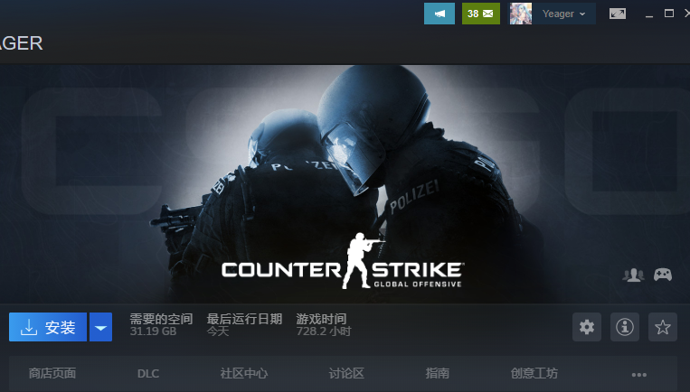
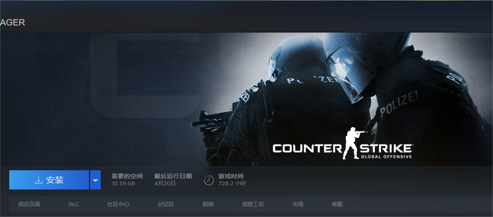
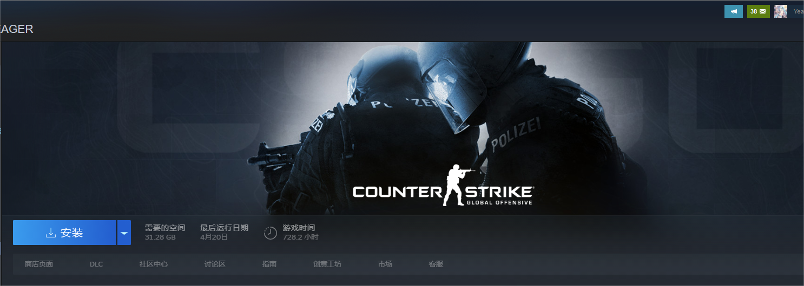
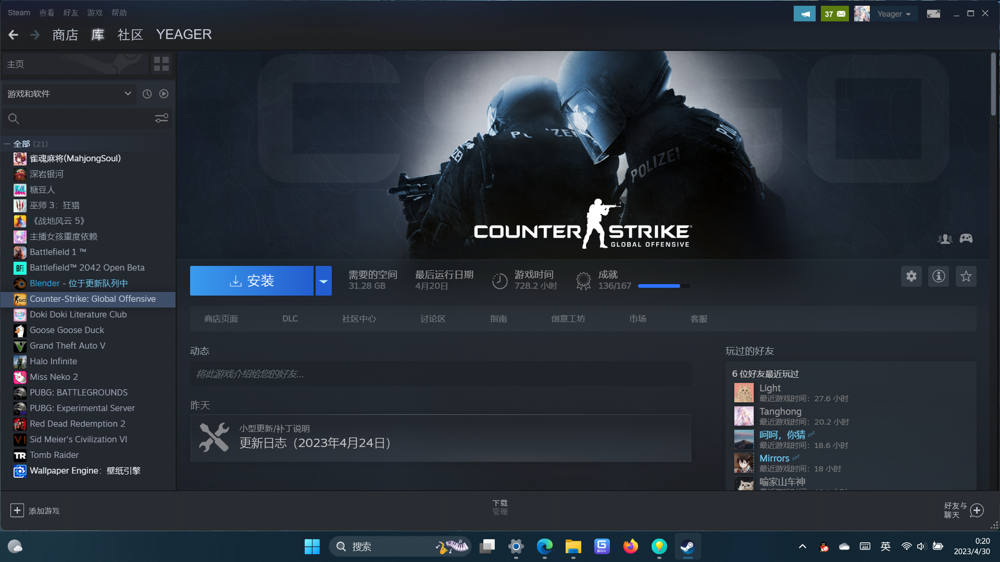
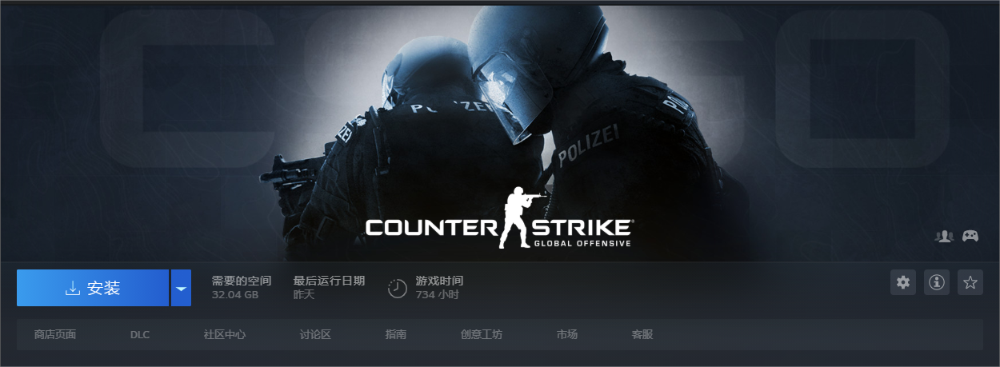

**为了抵制游戏诱惑，把更多的时间投入到更加重要的工作当中去，现在开始进行游戏禁止的打卡活动，我会坚持每周更新下去的！**
-主要针对的对象就是玩的最多的CSGO了，虽然我是真的很喜欢fps游戏，在这当中我也感到了快乐，但是这毕竟影响了我去做很多事情，所以是时候放一放了，预计在暑假之前都不会再碰这款游戏了，我将以steam的截图为证。



-**4.20**
从今天正式开始了！

-**4.22**
纪念一下，打个卡先

-**4.25**
五天啦

-**4.30**
十天啦！
忙里偷闲，在宾馆更新一下我好久没有更新的网站（四天！你知道这四天我是怎么过去的吗？！）
这些天却是都非常地忙碌，但也能显著感觉到自己的思考能力在逐渐回暖，思考任何问题都比之前浑浑噩噩的状态时更加清晰和明确了，希望我能继续维持这个状态，争取让大脑更多的回到以前的优秀状态吧。要做到这一点，持续性的禁止游戏也是必须的。
我很高兴，在五一放假的前一天晚上，我并没有像以往无数次一样，忘记一切，全身投入到打游戏当中，然后打到两三点钟。这次放假前的一天，我坚持住了认真听讲了8节课，并且也认真地去准备了并且进行了数电的操作考试（这在以前我估计就直接摆烂了），并且在回去之后并没有去打游戏（虽然也没成功去跑4.01千米去搞到小樱的奖章www，还有4月三十号一天不知道能不能成功打卡），并且还把寝室的卫生打扫了一下，然后就是继续看樱花庄的宠物女孩。这在以前对我来说是很不可能的，但是它确实发生了，我也很高兴能看到自己的变化。
我希望这一切都是值得的，我也希望能认识并且成为能让我自己满意的自己。

-**5.5**
打脸真是来的飞快，在5.2和5.5晚上分别进行了3~4小时和2小时的游戏。
其实导致我还是打游戏的原因非常的简单，就是以往重复过无数次的原因，一次是因为出去逛的太累了，回到电脑旁边看到别人在看动画，便萌生出了“打一会游戏”的想法，而今天晚上的则是常见的因为考完试所以直接去打游戏了。
实际上，这两次我事先都没有打游戏放松一下的打算，纯粹是因为自己没控制好自己，就拿今晚来说，我带电脑回来本意是把项目进度推进一下的，不成想还是没控制住自己。
但是，我也并不认为这是前功尽弃，起码我打了一会儿就收手了，我觉得我已经逐渐可以控制自己的一些娱乐行为了，为了未来的目标，进一步的控制也是十分必要的。
所以这个模块将继续存在，可能会变成我的游戏记录模块？
不管怎样，斗争的经历也值得被铭记。
