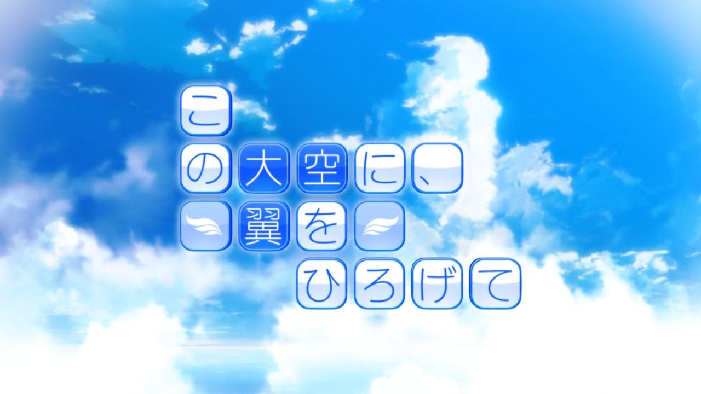

《在这苍穹展翅》是一部非常经典的社团青春恋爱故事向作品，里面的剧情可以说是非常的具有代表性，因为事故不能在继续骑自行车的男主，和同样因为事故不能走路的女主羽羽音小鸟邂逅，两人在同一所学校，加入滑翔机社，并且为了造出能在天空中翱翔的滑翔机的故事，看起来十分地古典，但我想这也正是这部作品依然能打动我的心弦的原因。

这部作品首先在画风上非常对我胃口，画风简单清爽，很有青春时期没有任何修饰的美感。特别是女主角羽羽音小鸟，看上去第一眼就是那种好像可以随处可见的路人女主一样，但是也正因此可以激发出每个人心中最青春美好的幻想。初来乍到，小鸟是一个非常不愿意与他人接触，看起来十分不懂礼貌的人，甚至说的许多话隔着屏幕都会刺耳，实际上在现实生活中，如果遇到这样的人，早就会让人讨厌了吧。在游戏中也是如此，绝大多数人都不和小鸟说话，这也进一步加深了小鸟与外界的隔阂。但是在一同生活的过程中，其实可以很强烈地体会到，小鸟身上那种迸发出来的青春的有活力的俏皮气息，不像是一个一直都很冷淡的人，而更像是一个原本活泼的人遭受了打击后而导致的。之后的剧情慢慢流淌，小鸟一直有一个在天上飞的梦想，而男主也被吸引，大家一起加入了滑翔机社，尽管过了好几年，也经历了不少的事情，当再一次看到这种经典的校园社团奋斗的故事时，我还是会感觉回到了高中时代那个静静地看着CLANNAD的时光，十分地美好，令人怀念。这种感情，可能过了很多年以后依然会让人感到温暖，感到浑身震颤吧。

我要特别说明一下后半段的剧情，这半段剧情我必须给予很高的评价，因为其中小鸟与家里以及其他人的矛盾一波三折，在代入进去作品后还显得十分合情合理（当然换成我现在这种老东西的视角来看，冒着风险去做这一件事情都会觉得有一些些不好了，终究是老了，心境也不像年轻人了），里面的几个动画CG的加入好多次让我以为游戏要结束了（也说明高潮部分做的比较不错嘛）。直到最后我都以为要是BE了，结果大家妙手回春，最后小鸟如愿以偿翱翔在了天际。

不过，虽然是同类型的作品，这部作品本身还是与CLANNAD有着很大的不同，我推小鸟线的时候最明显的感觉就是这部作品聚焦的是小鸟的改变与成长，主角更像是一个操心的老父亲，要将叛逆的女儿照顾好。还有一点就是，可能也是因为经历了一些，以往我可能会觉得小鸟这么好这么喜欢男主和她一直在一起吧！但是不可忽视的是小鸟的腿部是完全不能动的，而且除了到最后给了一个惊喜，在整部作品中，我们都是被告知小鸟以后一辈子都是要在轮椅上的。这确实让人心痛，尤其是作为伴侣来说，我发现我在整个游玩的过程中也会时不时地感受到这样一丝淡淡的忧伤与忧虑，这也许也是有了作品之外的经历后，在作品上体现出来的所谓的"大人的视角"吧。但不论如何，小鸟最后能够回归正常确实是皆大欢喜，哪怕在现实中根本不可能有这样的奇迹。但尽管如此，我还是希望，不要忘记作品给我们传达的希望，不要被现实的洪流整个压垮，最终变成自己最不喜欢的模样。

